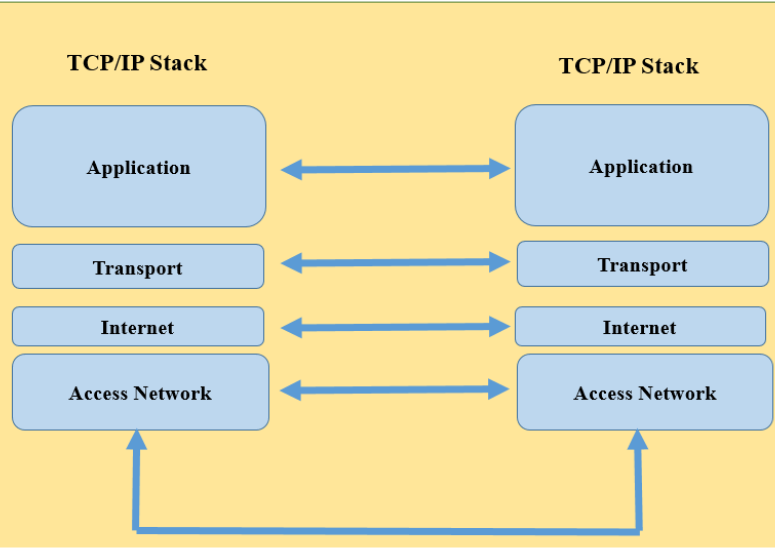
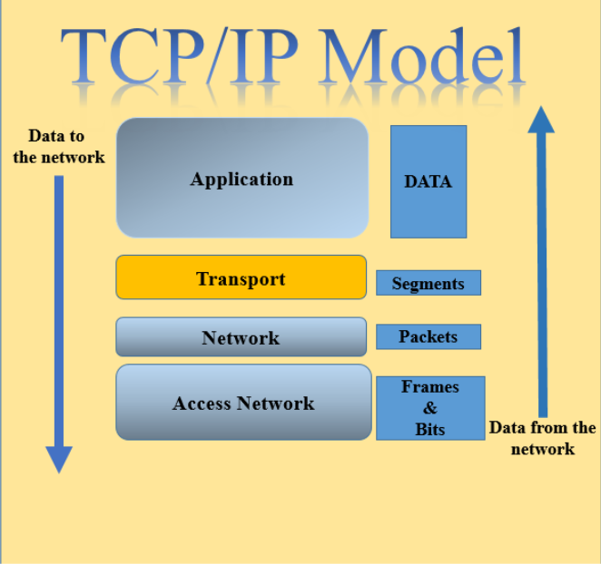
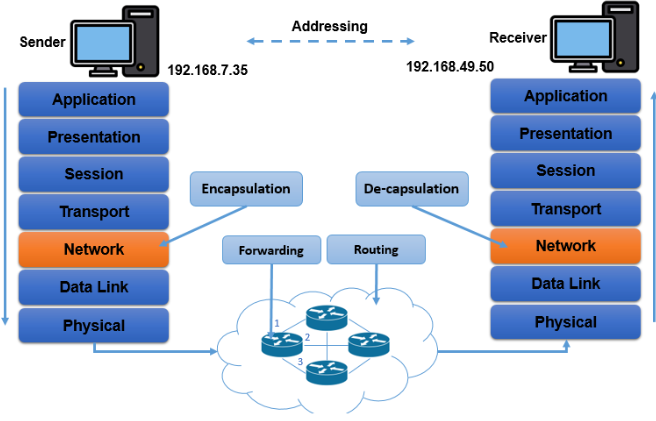

# Tổng quan mô hình TCP/IP

- [Tổng quan mô hình TCP/IP](#tổng-quan-mô-hình-tcpip)
  - [1.Vài nét về TCP/IP](#1vài-nét-về-tcpip)
  - [2. Ưu điểm TCP /IP](#2-ưu-điểm-tcp-ip)
  - [3.Kiến trúc phân tầng](#3kiến-trúc-phân-tầng)
  - [4. Cách thức hoạt động](#4-cách-thức-hoạt-động)
  - [5. Chức năng của các tầng trong mô hình TCP/IP](#5-chức-năng-của-các-tầng-trong-mô-hình-tcpip)
  - [6. Các giao thức phổ biến](#6-các-giao-thức-phổ-biến)
  - [7. Một số giao thức khác bộ giao thức TCP/IP](#7-một-số-giao-thức-khác-bộ-giao-thức-tcpip)
  - [8. So sánh mô hình TCP và mô hình OSI](#8-so-sánh-mô-hình-tcp-và-mô-hình-osi)

## 1.Vài nét về TCP/IP
Giao thức TCP/ IP được ổn định hóa từ đầu năm 1978 và được bắt nguồn bởi Kỹ sư Vinton Cerf và Robert E. Kahn. Họ được xem là 1 trong những người dẫn đầu của Internet. Kể từ đó, mô hình TCP/IP được phổ biến và sử dụng rộng rãi trên khắp thế giới đến nay. 
TCP / IP ban đầu được thiết kế cho Hệ điều hành Unix và nó đã được tích hợp vào tất cả các Hệ điều hành sau nó.
## 2. Ưu điểm TCP /IP
TCP/IP có một số ưu điểm như sau:
Không chịu kiểm soát của tổ chức
Ưu điểm lớn nhất mà không thể phủ nhận đó là TCP/IP sẽ không chịu sự kiểm soát của bất kỳ tổ chức nào. Do đó, bạn có thể sử dụng tự do. 
Tương thích với các hệ điều hành
Giao thức chuẩn mở sẵn sàng phát triển độc lập với phần cứng và hệ điều hành. TCP/IP là giao thức lý tưởng cho việc hợp nhất phần cứng và phần mềm khác nhau, ngay cả khi truyền thông trên Internet. 
Sự độc lập rành mạch với phần cứng vật lý của mạng cho phép TCP/IP hợp nhất các mạng khác nhau. 
TCP/IP có thể chạy trên mạng Ethernet, mạng Token ring, mạng quay số (Dial-up line), mạng X.25, mạng ảo và mọi loại môi trường vật lý truyền thông. 

Khả năng mở rộng cao
Với nhiều tính năng mở rộng cao, mô hình này có thể định tuyến và có thể xác định được đường dẫn hiệu quả nhất thông qua mạng.
## 3.Kiến trúc phân tầng
Có nhiều giao thức trong bộ giao thức truyền thông TCP/IP, nhưng hai giao thức quan trọng nhất được lấy tên đặt cho bộ giao thức này là TCP (Transmission Control Protocol) và IP (Internet Protocol). 

Các lớp tương ứng giữa OSI và TCP/IP

Bộ giao thức TCP/IP được phân làm 4 tầng 
• Tầng mạng (Network Layer) 
• Tầng Internet (Internet Layer) 
• Tầng giao vận (Transport Layer) 
• Tầng ứng dụng (Application Layer)
## 4. Cách thức hoạt động

 Cũng giống như trong mô hình tham chiếu OSI
 Dữ liệu gửi từ tầng Application đi xuống ngăn xếp, mỗi tầng có những định nghĩa riêng về dữ liệu mà nó sử dụng. 
Tại nơi gửi, mỗi tầng coi gói tin của tầng trên gửi xuống là dữ liệu của nó và thêm vào gói tin các thông tin điều khiển của mình sau đó chuyển tiếp xuống tầng dưới. 
Tại nơi nhận, quá trình diễn ra ngược lại, mỗi tầng lại tách thông tin điều khiển của mình ra và chuyển dữ liệu lên tầng trên.

## 5. Chức năng của các tầng trong mô hình TCP/IP

**Tầng 4 - Tầng Ứng dụng (Application layer)**

Phần lớn người sử dụng chỉ quan tâm tới các dịch vụ thông tin được cung cấp trên Internet. Tầng 4 có vai trò giao tiếp dữ liệu giữa 2 máy khác nhau.
Cung cấp cho các ứng dụng những trao đổi dữ liệu chuẩn hóa, giao tiếp dữ liệu giữa 2 máy khác nhau thông qua các dịch vụ mạng khác nhau.

Các ứng dụng có sớm nhất của Internet là Telnet, FTP, SMTP, DNS ngoài ra ngày nay có hàng ngàn ứng dụng khác đang phát triển và ngày một nhiều : HTTP,HTTPS,Mail,

**Tầng 3 – Tầng giao vận(transport Layer)**

Tầng giao thức này nằm dưới tầng Ứng dụng , Tầng giao vận (Host-to-Host Transport Layer hay thường gọi là Transport Layer). 
Hai giao thức quan trọng nhất của tầng này là Transmission Control Protocol (TCP) và User Datagram Protocol (UDP). 
TCP cung cấp dịch vụ chuyển giao thông tin có kết nối (connection-oriented), nó bao gồm cả việc kiểm tra và sửa lỗi. 
UDP cung cấp dịch vụ kém tin cậy hơn (unreliable) và không thiết lập liên kết trước (connectionless). 
Cả hai giao thức đều chuyển giao thông tin giữa tầng ứng dụng và tầng Internet. Chương trình ứng dụng có thể lựa chọn dịch vụ nào thích hợp với nó.

**Tầng 2 - Tầng mạng ( internet layer)**

Vị trí của lớp Internet nằm giữa lớp Network Access và lớp Transport.

Chức năng quan trọng nhất của tầng Internet chịu trách nhiệm định tuyến (dẫn đường) cho các gói tin và chọn lựa con đường tối ưu để truyền các gói tin từ trạm nguồn tới trạm đích.
Chức năng tiếp thoại đóng gói dữ liệu thành các gói được gọi là IP Packet
IP Packet chứa địa chỉ IP nguồn và  địa chỉ IP đích (nó giống như việc 1 bức thư có địa chỉ người gửi và địa chỉ người nhận).
Khi các gói tin được gửi tới địa chỉ IP đích các gói dữ liệu có thể xuất hiện theo thứ tự khác với thứ tự được gửi đi. Nhiệm vụ của các lớp cao hơn là sắp xếp lại chúng để đưa chúng đến các ứng dụng mạng thích hợp hoạt động ở lớp Application .

Các giao thức chính bao gồm ở tầng Internet:
IP (Internet Protocol)
ICMP (Internet Control Message Protocol)
ARP (Address Resolution Protocol)
RARP (Reverse Address Resolution Protocol)
IGMP (Internet Group Management Protocol).

**Tầng 1 - Tầng NetWork Access**

Bao gồm các giao thức chỉ hoạt động trên một liên kết - thành phần mạng kết nối các nút hoặc máy chủ trong mạng. Các giao thức trong lớp thấp nhất này bao gồm Ethernet cho mạng cục bộ và Giao thức phân giải địa chỉ .
Các chức năng trong tầng này bao gồm đóng gói  thông tin Packet của tầng internet thành các "Frame" được truyền dẫn trên mạng và chuyển địa chỉ IP thành địa chỉ vật lý sử dụng bởi mạng máy tính. 
Một trong số các điểm mạnh của bộ  Giao thức TCP/IP là địa chỉ của nó được phối hợp sao cho trên mạng Internet không có một thiết bị mạng nào cùng tên. Địa chỉ này phải được chuyển đổi thích hợp với địa chỉ mạng vật lý nơi mà dữ liệu được truyền đi.

## 6. Các giao thức phổ biến 

**Giao thức HTTP** :

Các dữ liệu không an toàn giữa một web client và một web server sẽ được truyền nhờ giao thức HTTP.
Theo quy trình, web client (trình duyệt Internet trên máy tính) sẽ gửi một yêu cầu đến một web server để xem một website. Tiếp đó, khi server web nhận được yêu cầu và gửi thông tin website về cho web client.

**Giao thức HTTPS** :

Ngược lại với HTTP, giao thức HTTPS được dùng để truyền dữ liệu an toàn giữa một web client và một web server.
Giao thức HTTPS được sử dụng để gửi dữ liệu giao dịch của thẻ tín dụng hoặc dữ liệu cá nhân khác từ một web tới một web server.

**FTP (File transfer Protocol):**

 Giao thức truyền tệp cho phép người dùng lấy hoặc gửi tệp tới một máy khác.

## 7. Một số giao thức khác bộ giao thức TCP/IP

 

 • Telnet: Chương trình mô phỏng thiết bị đầu cuối cho phép người dùng login vào một máy chủ từ một máy tính nào đó trên mạng.

• SMTP (Simple Mail Transfer Protocol): Một giao thức thư tín điện tử. Application Layer Transport Layer (Host Layer) Internal Layer (Gateway Layer) Network Interface Layer RIP SMTP SNMP Transmission Control Protocol User Datagram Protocol FTP TELNET Internet Protocol ICMP ARP Ethernet Token Ring Token Bus Fiber DNS Các tầng của bộ giao thức TCP/IP Luận văn tốt nghiệp Phan Thăng 23 

• DNS (Domain Name server): Dịch vụ tên miền cho phép nhận ra máy tính từ một tên miền thay cho chuỗi địa chỉ Internet khó nhớ.

 • SNMP (Simple Network Management Protocol): Giao thức quản trị mạng cung cấp những công cụ quản trị mạng.

 • RIP (Routing Internet Protocol): Giao thức dẫn đường động. 

• ICMP (Internet Control Message Protocol): Nghi thức thông báo lỗi.

 • UDP (User Datagram Protocol): Giao thức truyền không kết nối cung cấp dịch vụ truyền không tin cậy nhưng tiết kiệm chi phí truyền.

 • TCP (Transmission Control Protocol): Giao thức hướng kết nối cung cấp dịch vụ truyền thông tin tưởng.

 • IP (Internet Protocol): Giao thức Internet chuyển giao các gói tin qua các máy tính đến đích. 
 
 • ARP (Address Resolution Protocol): Cơ chế chuyển địa chỉ TCP/IP thành địa chỉ vật lý của các thiết bị mạng
## 8. So sánh mô hình TCP và mô hình OSI 

TCP/IP chỉ sử dụng tầng ứng dụng để xác định chức năng của các tầng trên. Trong khi đó, OSI sử dụng đến ba tầng (Application, presentation và session).

TCP/IP sử dụng Link Layer để xác định chức năng tầng dưới cùng.

 Đối với OSI, nó sử dụng hai tầng: Physical và Data Link.
OSI sử dụng lớp Network để xác định các tiêu chuẩn và giao thức định tuyến. Chức năng này được quản lý bởi tầng internet của TCP/IP.

Mô hình TCP/IP là một tiêu chuẩn oriented protocol. Trong khi đó, OSI là một mô hình chung dựa trên chức năng của mỗi lớp.
Cách tiếp cận của TCP/IP là tiếp cận ngang, trong khi của OSI là dọc.

Trong bộ TCP/IP, các giao thức được phát triển trước mô hình. Quá trình này ngược lại so với OSI.

TCP/IP giúp thiết lập kết nối giữa các loại máy tính với nhau. Mặt khác, OSI giúp chuẩn hóa các router, switch, bo mạch chủ và các phần cứng khác.

**Kiến thức cần nhớ:**

Mỗi mô hình đều có cách vận hành cũng như chức năng khác nhau. Tuy nhiên, có thể thấy TCP/IP là một mô hình thực tế hơn khi nó đặt ra các tiêu chuẩn mà internet được tạo ra. Trong khi đó, OSI cung cấp các hướng dẫn về cách giao tiếp phải được thực hiện.

Tài liệu tham khảo : 
https://vi.wikipedia.org/wiki/TCP/IP

