# **TÌM HIỂU VỀ VLAN VÀ CẤU HÌNH VLAN**

- [**TÌM HIỂU VỀ VLAN VÀ CẤU HÌNH VLAN**](#tìm-hiểu-về-vlan-và-cấu-hình-vlan)
  - [**1. Tổng quan về VLAN**](#1-tổng-quan-về-vlan)
    - [**1.1 Khái niệm**](#11-khái-niệm)
    - [**1.2 Phân loại VLAN**](#12-phân-loại-vlan)
    - [**1.3 Lợi ích của VLAN**](#13-lợi-ích-của-vlan)
    - [**1.4 Khi nào bạn cần một VLAN?**](#14-khi-nào-bạn-cần-một-vlan)
    - [**1.6 Tại sao không chia subnet**](#16-tại-sao-không-chia-subnet)
  - [**2. Trunking**](#2-trunking)
    - [**2.1 Trunking là gì ?**](#21-trunking-là-gì-)
    - [**2.2 Trunking giải quyết bài toán gì ?**](#22-trunking-giải-quyết-bài-toán-gì-)
  - [**3.Cách tạo Vlan, chia Vlan cho các thiết bị mạng switch**](#3cách-tạo-vlan-chia-vlan-cho-các-thiết-bị-mạng-switch)
    - [3.1. Mô hình mạng và Ip Planning](#31-mô-hình-mạng-và-ip-planning)
    - [**3.2 Cấu hình VLAN**](#32-cấu-hình-vlan)
  - [3.3 Cấu hình mode trunk giữa 2 sw khi có nhiều VLAN đi qua:](#33-cấu-hình-mode-trunk-giữa-2-sw-khi-có-nhiều-vlan-đi-qua)
    - [**3.4 Cho phép những Vlan ảo chạy qua Trunk**](#34-cho-phép-những-vlan-ảo-chạy-qua-trunk)
    - [**3.5 Tiến hành kiểm tra Ping**](#35-tiến-hành-kiểm-tra-ping)

## **1. Tổng quan về VLAN**
### **1.1 Khái niệm**
- VLAN (Virtual Local Area Network) còn gọi là mạng LAN ảo.
- Vlan tức là 1 mạng riêng ảo nó kết nối các phòng ban chức năng không phụ thuộc vị trí địa lý.
- 1 con SW vật lý tạo được nhiều con SW bên trong người ta gọi là VLAN ảo
- Về mặt kỹ thuật, VLAN là một miền quảng bá được tạo bởi các switch. 

Bình thường thì router đóng vai trò tạo ra miền quảng bá. 

- Đối với VLAN, switch có thể tạo ra miền quảng bá.
- Việc này được thực hiện khi bạn - quản trị viên - đặt một số cổng switch trong VLAN ngoại trừ VLAN 1 - VLAN mặc định. Tất cả các cổng trong một mạng VLAN đơn đều thuộc một miền quảng bá duy nhất.
- Vì các switch có thể giao tiếp với nhau nên một số cổng trên switch A có thể nằm trong VLAN 10 và một số cổng trên switch B cũng có thể trong VLAN 10. Các bản tin quảng bá giữa những máy tính này sẽ không bị lộ trên các cổng thuộc bất kỳ VLAN nào ngoại trừ VLAN 10. Tuy nhiên, tất cả các máy tính này đều có thể giao tiếp với nhau vì chúng thuộc cùng một VLAN. Nếu không được cấu hình bổ sung, chúng sẽ không thể giao tiếp với các máy tính khác nằm ngoài VLAN này.
### **1.2 Phân loại VLAN**
- Port-based VLAN: là cách cấu hình VLAN đơn giản và phổ biến. Mỗi cổng của Switch được gắn với một VLAN xác định (mặc định là VLAN 1), do vậy bất cứ thiết bị host nào gắn vào cổng đó điều thuộc một VLAN nào đó.
- MAC address based VLAN: Cấu hình này ít được sử dụng do có nhiều bất tiện trong việc quản lý. Mỗi địa chỉ MAC được đánh dấu với 1 VLAN xác định.
- Protocol – based VLAN: Cách cấu hình này gần giống như MAC Address based, nhưng sử dụng một địa chỉ logic hay địa chỉ IP thay thế cho địa chỉ MAC. Cách cấu hình không còn thông dụng nhờ sử dụng giao thức DHCP.
### **1.3 Lợi ích của VLAN**
- **Tiết kiệm băng thông của hệ thống mạng**: VLAN chia mạng LAN thành nhiều đoạn (segment) nhỏ, mỗi đoạn đó là một vùng quảng bá (broadcast domain). Khi có gói tin quảng bá (broadcast), nó sẽ được truyền duy nhất trong VLAN tương ứng. Do đó việc chia VLAN giúp tiết kiệm băng thông của hệ thống mạng.
- **Tăng khả năng bảo mật**: Do các thiết bị ở các VLAN khác nhau không thể truy nhập vào nhau (trừ khi ta sử dụng router nối giữa các VLAN). Như trong ví dụ trên, các máy tính trong VLAN kế toán (Accounting) chỉ có thể liên lạc được với nhau. Máy ở VLAN kế toán không thể kết nối được với máy tính ở VLAN kỹ sư (Engineering).
- **Dễ dàng thêm hay bớt máy tính vào VLAN**: Việc thêm một máy tính vào VLAN rất đơn giản, chỉ cần cấu hình cổng cho máy đó vào VLAN mong muốn.
- **Giúp mạng có tính linh động cao**: VLAN có thể dễ dàng di chuyển các thiết bị. Giả sử trong ví dụ trên, sau một thời gian sử dụng công ty quyết định để mỗi bộ phận ở một tầng riêng biệt. Với VLAN, ta chỉ cần cấu hình lại các cổng switch rồi đặt chúng vào các VLAN theo yêu cầu. VLAN có thể được cấu hình tĩnh hay động. Trong cấu hình tĩnh, người quản trị mạng phải cấu hình cho từng cổng của mỗi switch. Sau đó, gán cho nó vào một VLAN nào đó. Trong cấu hình động mỗi cổng của switch có thể tự cấu hình VLAN cho mình dựa vào địa chỉ MAC của thiết bị được kết nối vào.

- Thêm một vấn đề quan trọng nữa, đó là trên switch Cisco, VLAN được kích hoạt mặc định và tất cả các máy tính đã nằm trong một VLAN. VLAN đó chính là VLAN 1. Bởi thế mà theo mặc định, bạn có thể sử dụng tất cả các cổng trên switch và tất cả các máy tính đều có khả năng giao tiếp với nhau.
### **1.4 Khi nào bạn cần một VLAN?**
Bạn cần cân nhắc việc sử dụng VLAN trong các trường hợp sau:

- Bạn có hơn 200 máy tính trong mạng LAN
- Lưu lượng quảng bá (broadcast traffic) trong mạng LAN của bạn quá lớn
- Các nhóm làm việc cần gia tăng bảo mật hoặc bị làm chậm vì quá nhiều bản tin quảng bá.
- Các nhóm làm việc cần nằm trên cùng một miền quảng bá vì họ đang dùng chung các ứng dụng. Ví dụ như một công ty sử dụng điện thoại VoIP. Một số người muốn sử dụng điện thoại có thể thuộc một mạng VLAN khác, không cùng với người dùng thường xuyên.

### **1.6 Tại sao không chia subnet** 
Có 100 PC, thì việc chia subnet giống như chia nhóm các PC chỉ khác mạng nhau, còn lớp 2 (broadcast domain) thì cùng nhau , nên khi xảy ra broadcast thì toàn bộ 100PC đều ảnh hưởng như nhau. Việc chia vlan cũng giống như chia Subnet sang phòng khác nhưng chia vlan giúp ngăn chặn broadcast domain và khi gửi các gói tin đi thì chỉ trong vùng quảng bá đấy nhận được trách gây lãng phí tài nguyên và bảo mật thông tin.

## **2. Trunking**
### **2.1 Trunking là gì ?**

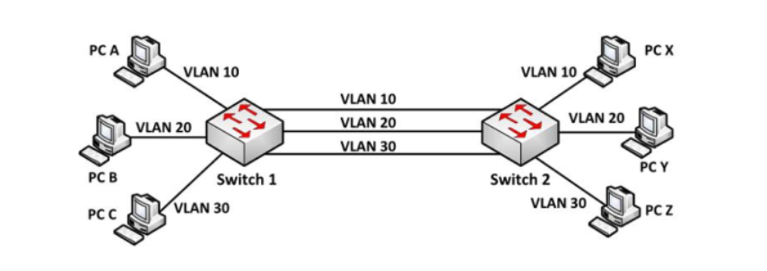

Khi chúng ta thực hiện chia SW thành các mạng Vlan như đã trình bày ở trên thì chúng ta giải quyết được bài toán tiết kiệm chi phí khi chỉ cần 1 con SW vật lý có thể tạo được nhiều Vlan tương đương vs các phòng ban khác nhau, Nhưng xảy ra 1 bài toán khác là mỗi 1 Vlan sẽ có n dây đi riêng giống như trong hình.

### **2.2 Trunking giải quyết bài toán gì ?**

Trunking sinh ra để giải quyết bài toán gom các dây thành 1 dây duy nhất để tránh gây lãng phí tài nguyên.Người ta gọi kết nối này là đường trunk.

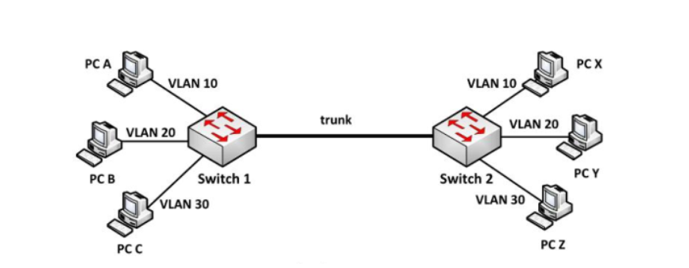

## **3.Cách tạo Vlan, chia Vlan cho các thiết bị mạng switch**
### 3.1. Mô hình mạng và Ip Planning
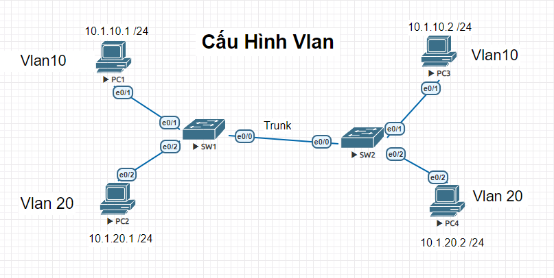

**Ip Planning**:


### **3.2 Cấu hình VLAN**
>Thực hiện trên PC1 :


```
Router(config)#hostname PC1
PC1(config)#int e0/1
PC1(config-if)#ip add 10.1.10.1 255.255.255.0
PC1(config-if)#no shut
```

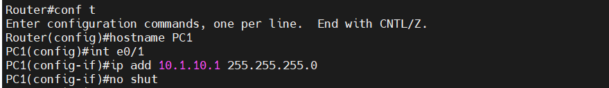


> Thực hiện trên PC 2 :

```
PC2(config)#int e0/2
PC2(config-if)#ip add 10.1.20.1 255.255.255.0
PC2(config-if)#no shut
```
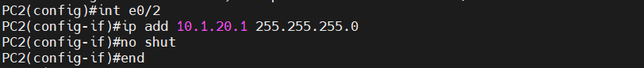


> Thực hiện tương tự trên PC 3,4 

```
PC3(config)#int e0/1
PC3(config-if)#ip add 10.1.10.2 255.255.255.0
PC3(config-if)#no shut
PC3(config-if)#end

```

```
Router(config)#int e0/2
Router(config-if)#ip add 10.1.20.2 255.255.255.0
Router(config-if)#no shut
```
> Thực hiện trên SW1

Tạo Vlan và gắn các port Vlan cho SW1 :

lệnh:

```
SW1(config)#vlan 10
SW1(config-vlan)#vlan 20
SW1(config-vlan)#ex
SW1(config)#int e0/1
SW1(config-if)#sw
SW1(config-if)#switchport mode access
SW1(config-if)#swit
SW1(config-if)#switchport access vlan 10
SW1(config-if)#ex
SW1(config)#int e0/2
SW1(config-if)#sw
SW1(config-if)#switchport mode access
SW1(config-if)#sw
SW1(config-if)#switchport access vlan 20
SW1(config-if)#end
```

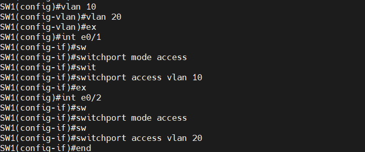

Kiểm tra Vlan :

- Lệnh	Show vlan brief	:

```
show vlan brief

```

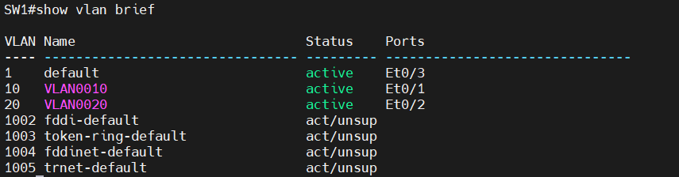

>Thực hiện trên SW2:

Tạo Vlan và gắn các port Vlan cho SW2 :

lệnh:

```
SW2(config)#vlan 10
SW2(config-vlan)#vlan 20
SW2(config-vlan)#ex
SW2(config)#int e0/1
SW2(config-if)#sw
SW2(config-if)#switchport mode access
SW2(config-if)#sw
SW2(config-if)#switchport access vlan 10
SW2(config-if)#ex
SW2(config)#int e0/2
SW2(config-if)#sw
SW2(config-if)#sw
SW2(config-if)#switchport mode access
SW2(config-if)#sw
SW2(config-if)#switchport access vlan 20
SW2(config-if)#ex
SW2(config)#end

```

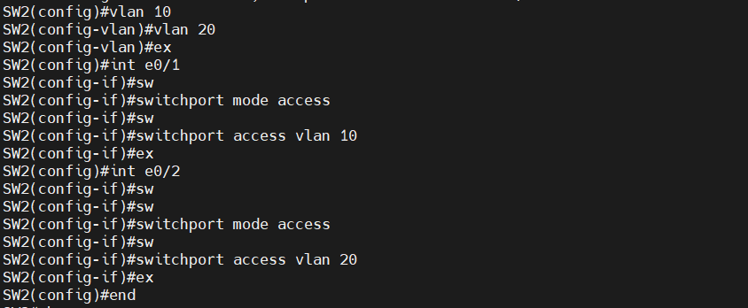


Kiểm tra Vlan :

- Lệnh	Show vlan brief	:

```
show vlan brief

```
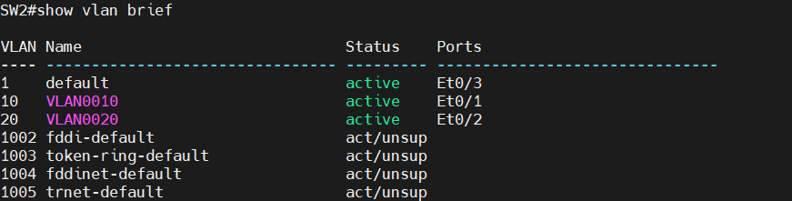


## 3.3 Cấu hình mode trunk giữa 2 sw khi có nhiều VLAN đi qua:
> Thực hiện trên SW1:

Cấu hình :

```
SW1(config)#int e0/0
SW1(config-if)#sw
SW1(config-if)#switchport trunk en
SW1(config-if)#switchport trunk encapsulation dot1q
SW1(config-if)#sw
SW1(config-if)#switchport mode trunk
SW1(config-if)#end
```

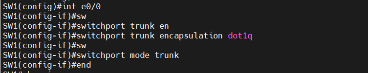

- Dùng lệnh show int trunk để thấy kết quả
```
show int trunk
```

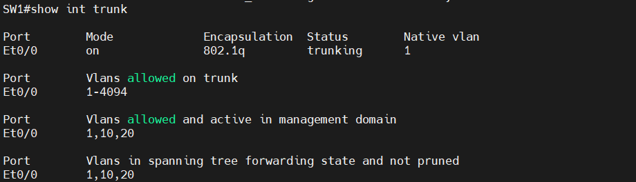

> Thực hiện trên SW2:

Cấu hình :

```
SW2(config)#int e0/0
SW2(config-if)#sw
SW2(config-if)#switchport trunk en
SW2(config-if)#switchport trunk encapsulation dot1q
SW2(config-if)#sw
SW2(config-if)#switchport mode trunk
SW2(config-if)#end
```


- Dùng lệnh show int trunk để thấy kết quả
```
show int trunk
```


### **3.4 Cho phép những Vlan ảo chạy qua Trunk**

> Thực hiện trên SW1,SW2 :

```
SW1(config)#int e0/0
SW1(config-if)#sw trunk allowed vlan 10
SW1(config-if)#sw trunk allowed vlan add 20
```
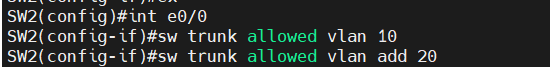
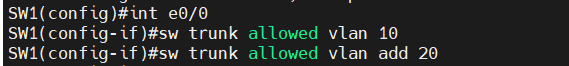

### **3.5 Tiến hành kiểm tra Ping**

Thực hiện kiểm tra ping từ ``PC 1`` đến ``PC 3`` trong cùng mạng lan :
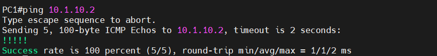

Thực hiện kiểm tra ping từ ``PC 2`` đến ``PC 4`` trong cùng mạng lan :


Thực kiểm tra ping từ ``PC 1 `` đến ``PC2`` khác mạng lan :


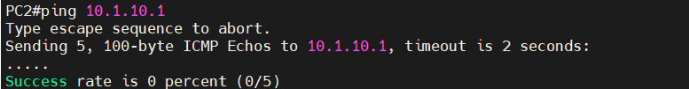


Ta thấy khi ping khác vùng VLAN sẽ xảy ra ko thể ping đến phòng ban khác được, điều này lại đặt ra 1 bài toán khi các phòng ban muốn kết nối với nhau thì phải làm như nào ? 

Bài InterVlan sẽ giải quyết vấn đề này :

https://github.com/TuanNguyen76/TaiLieuCaNhan/blob/T%C3%A0i-li%E1%BB%87u-c%C3%A1-nh%C3%A2n/T%C3%A0i_Li%E1%BB%87u_C%C3%A1_Nh%C3%A2n/1.CCNA/10.CCNA_day_10(Int_VLAN).md


