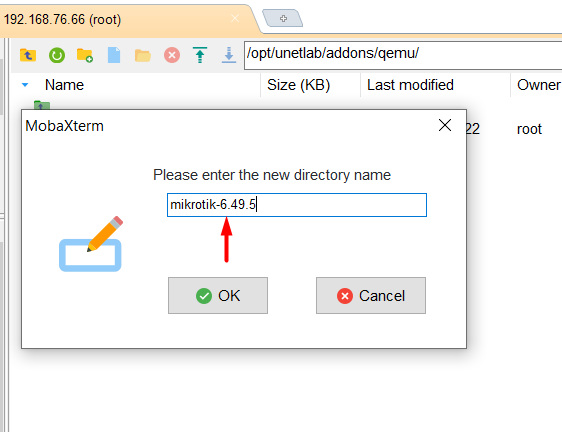
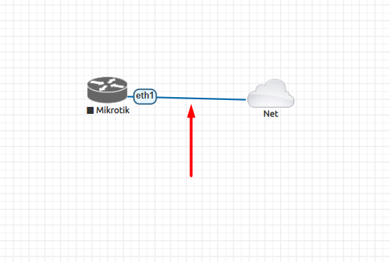

**Hướng dẫn thêm Router Mikrotik vào EVE-NG**

Link cài image chr-6.40.4.img.zip :

<https://mikrotik.com/download>

Link hướng dẫn thêm Router Mikrotik của EVE-NG :

<https://www.eve-ng.net/index.php/documentation/howtos/howto-add-mikrotik-cloud-router/>

Link cài winbox :

<https://mikrotik.com/download>

**Hướng dẫn cài Mikrotik :**

**Tải theo bản eve-ng hướng dẫn :**

*Do thời điểm hướng dẫn bài lab sử dụng phiên bản cũ hơn thời điểm xem hướng dẫn nên chúng ta sẽ tự hiểu nên cài bản nào cho phù hợp :*

Sau khi tải file ZIP xuống tiến hành open file ZIP và kéo thả file .img ra ngoài 

Tạo 1 phiên kết nối SFTP bằng phần mềm mobaxterm  :

Tiến hành truy cập theo đường dẫn /opt/unetlab/addons/qemu/ :

Tạo 1 thư mục mới đúng tên với phiên bản tải xuống :

Kéo thả file vào thư mục mikrotik-6.49.5 :

Đổi tên file thành hda.qcow2 có 2 cách :

Cách 1 : Sửa trực tiếp bằng giao diện phần mềm :

Cách 2 Sửa bằng dòng lệnh :

Tạo phiên SSH vào EVE-ng :

` `Tiến hành cd vào thư mục và sử dụng lệnh mv để đổi tên :

|
cd /opt/unetlab/addons/qemu/mikrotik-6.49.5/

mv chr-6.49.5.img hda.qcow2
|
| :- |

Xong quá trình cài đặt , kiểm tra trên trình duyệt :

Tạo 1 bài lab đơn giản :

Chuột phải thêm node và tìm kiếm MikroTik RouterOS :

Cấu hình Node (đặt tên, số cổng, Ram.v.v...) :

Thêm Network : 

Tiến hành nối dây vào cổng ether1 và bật lab :

Telnet cài mật khẩu và gắn địa chỉ cho cổng eth1 :

22)

Tiến hành đặt địa chỉ Ip cho cổng ether 1 :

|
Ip address 

Ip address > add address= 192.168.76.50/24 interface=ether1
|
| :- |

Tiến hành tải Winbox để quản trị Mikrotik :

Link cài đặt :

<https://mikrotik.com/download>

Sau khi tải xuống chuột phải và run as administrator: 

Sau khi cài đặt xong ta truy cập vào winBox và tiến hành nhập địa chỉ IP, user,pass và add set :

Thành công,giao diện quản trị MIkroTik :

