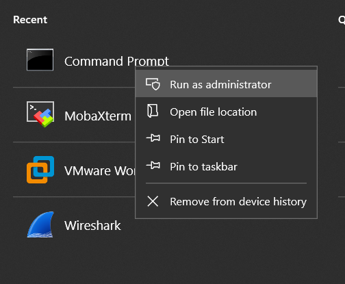
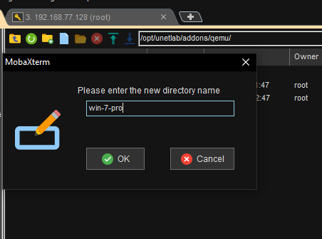

# **Hướng dẫn thêm máy ảo Win 7 vào EVE NG**

Các bước cài : 
# **Bước 1: Dựng win 7** 
Dựng OS win 7 trên VMware workstation

Link cài OS win 7 :

<https://docs.google.com/spreadsheets/d/e/2PACX-1vSScnE8yYzjgTlMiTpoGZ4VwDKHDanTld2_BXXliZg_nTyVVJq0ppvDJHiRFuMEoAO9UKHZqCG2o97T/pubhtml>
# **Bước 2 :** Cài các phần mềm cần thiết và tắt xoá các thiết bị không cần thiết để giảm dung lượng win 7.
Cài các phần mềm cần thiết sau khi dựng win 7:

- firefox
- putty <https://the.earth.li/~sgtatham/putty/latest/w32/putty-0.70-installer.msi>
- TFTP
- SCP  <https://winscp.net/download/WinSCP-5.13.4-Setup.exe>

Tắt các tính năng không cần thiết :

- Tắt firewall

- Tắt windows update
- Turn Off UAC

Xoá các option không cần thiết 

- Xoá các vmware tool
- Xoá các bản cài đặt của các phần mềm

*Các phần mềm cần thiết* 
# **Bước 3 :**Cài file Qemu để convert định dạng mkdr của win 7 sang dạng .qcow2 :
Link cài qemu để convert mkdir sang định dạng .qemu

<https://cloudbase.it/qemu-img-windows/>

- Tiến hành giải nén qemu-img-win-x64-2\_3\_0

- sau đó copy các file qemu-img-win-x64-2\_3\_0 vào nơi chứa file VMware Windows 7 (như hình bên dưới)

- Run cmd bằng administrator

- Gõ cd nơi lưu bộ cài windows 7 
  

=> Gõ tiếp D: để chuyển qua partition D và kiểm tra bằng lệnh DIR ta thấy bản win7 có đuôi .vmdk

=> Gõ tiếp 

|qemu-img convert -f vmdk -O qcow2 Windows7.vmdk hda.qcow2 |
| :- |

Chú ý : tên win7 giống như trong windows 7.vmdk (tuỳ mỗi máy sẽ có tên khác nhau)

**Win7x86.vmdk là disk của VMware còn**

**hda.qcow2 là disk để chạy trên Qemu trên EVE** 

=> Nhấn enter và khi xuất hiện dòng lệnh tiếp theo là quá trình convert đã xong :

- Kiểm tra File hda.qcow2 đã convert xong

- Ta tiến hành copy file này vào EVE, truy cập vào mobaxterm TFTP : **/opt/unetlab/addons/qemu/**

Tạo thư mục bắt buộc phải có cú pháp là  ‘**win-7-...**’     …đằng sau có thể tuỳ ý :

tìm đến nơi chứa file  .qcow2 để kéo thả vào thư mục win 7…… :

Chờ đợi cho đến khi quá trình kết thúc :

Xong :

Tiến hành SSH vào EVE-NG gõ lệnh sau :

|/opt/unetlab/wrappers/unl\_wrapper -a fixpermissions|
| :- |

**Bước 4** :Kiểm tra trên EVE-NG :

Tiến hành đăng nhập 

Thêm NOTE win 7 : 

Tạo 1 bài lab đơn giản : 

**Thành công :**

