# TRIỂN KHAI GIẢI PHÁP GIẢ LẬP THIẾT BỊ MẠNG VỚI UNETLAB-EVE


- [TRIỂN KHAI GIẢI PHÁP GIẢ LẬP THIẾT BỊ MẠNG VỚI UNETLAB-EVE](#triển-khai-giải-pháp-giả-lập-thiết-bị-mạng-với-unetlab-eve)
  - [1. Tổng quan về giải pháp giả lập mạng unetlab-eve](#1-tổng-quan-về-giải-pháp-giả-lập-mạng-unetlab-eve)
  - [2.Triển khai cài đặt giải pháp giả lập thiết bị mạng với EVE-NG](#2triển-khai-cài-đặt-giải-pháp-giả-lập-thiết-bị-mạng-với-eve-ng)
    - [2.1 Chuẩn bị](#21-chuẩn-bị)
    - [2.2 Cài đặt](#22-cài-đặt)
      - [1.2.2 Setup EVE-NG theo bản OVA:](#122-setup-eve-ng-theo-bản-ova)
      - [2.2.3 Cài đặt EVE-NG-Win-Client-pack](#223-cài-đặt-eve-ng-win-client-pack)
      - [2.2.4 Cài IOL-Cisco](#224-cài-iol-cisco)
  - [Link các bài hướng dẫn SecureSRT,router mikrotik,VNC(tích hợp win 7 vào EVE_NG)](#link-các-bài-hướng-dẫn-securesrtrouter-mikrotikvnctích-hợp-win-7-vào-eve_ng)

## 1. Tổng quan về giải pháp giả lập mạng unetlab-eve

1.1 Mô tả 

- UNetLab là giải pháp  mạnh mẽ nhất cho giả lập thiết bị mạng  hiện nay thay thế cho các phần mềm cơ bản packet tracer,GNS 3,....


- UNetLab, viết tắt cho Unified Networking Lab, là một bản phân phối của Linux cho phép bạn xây dựng hệ thống các bài lab network. 
 
- Nó cho phép triển khai giả lập các thiết bị mạng như switch, router, firewall, ... và các thiết bị cuối để kiểm tra thiết kế, kiểm thử các hoạt động của mô hình lab thực tế.
 
- EVE-NG (Emulated Virtual Environment – Next Generation) là phiên bản kế thừa những tính năng mạnh mẽ và vượt trội hơn so với Unetlab.
 
- EVE-NG là một công cụ mô phỏng mạng cung cấp giao diện người dùng thông qua trình duyệt. 
 
- EVE-NG là một dự án nguồn mở và mã nguồn EVE-NG được đăng trên GitLab.
 

## 2.Triển khai cài đặt giải pháp giả lập thiết bị mạng với EVE-NG

### 2.1 Chuẩn bị 

Yêu cầu máy tính :

- Máy tính vật lý có cấu hình tối thiểu : Ram 8gb, 50gb HDD
- Yêu cầu kết nối mạng Internet: có

Các phần mềm cần cài đặt:

- Vmware workstation
- Mobaxterm
- Phần mềm EVE-NG
- IOL cisco
- Command terminal SecureSRT,Putty….
- Window client Side
- Trình duyệt WEB : chrome,  Mozilla Firefox,Microsoft Edge,....

### 2.2 Cài đặt
#### 1.2.2 Setup EVE-NG theo bản OVA: 
Link cài đặt theo ISO :
- https://mega.nz/file/StlxEKTR#y_VoDiACVk_GKdu6OfRFHmfC0wqhKL_MKh8alcYJor0
Link cài đặt Ova  :
- ttps://mega.nz/file/qlt3zK7Q#LZdFhSxJPCpd4-QNyu5U6iajKmkjjMA7OzpbDLIjBsk
Hướng dẫn cài theo OVA :
Tìm đến thư mục chứa file EVE-NG và tiến hành giải nén :

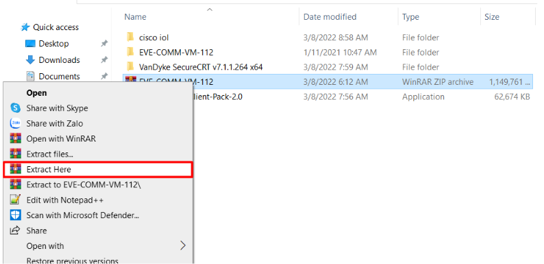


Truy cập vào VMWare và Open :


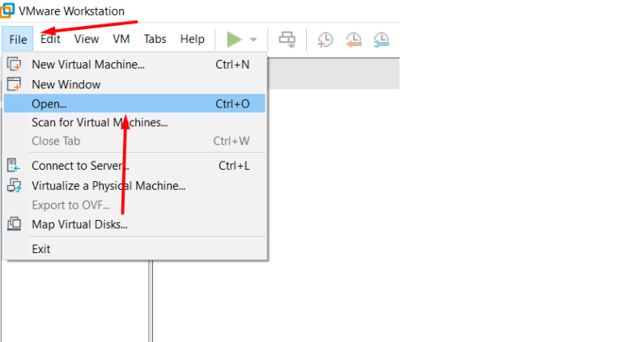

Tìm đến thư mục chứa bản Ova Eve-NG :

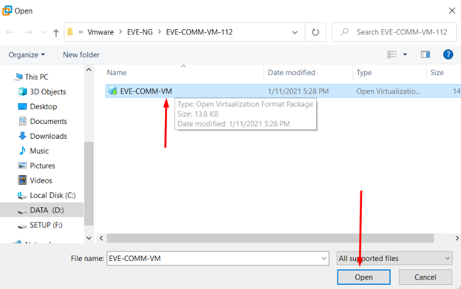

Điền tên và thư mục lưu trữ :

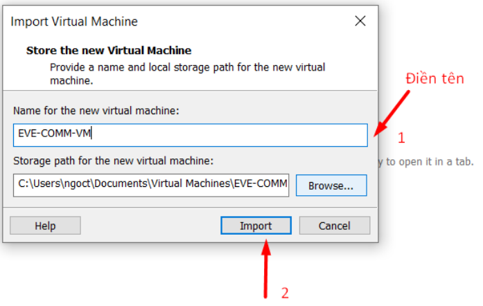

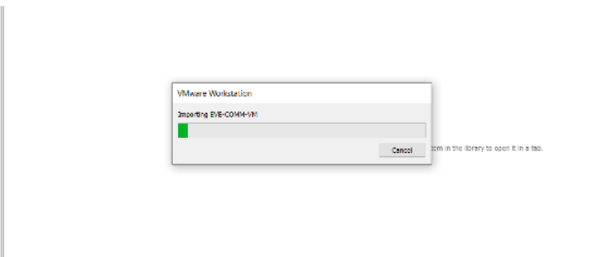	

Bước tiếp theo chỉnh sửa virtual machine setting :

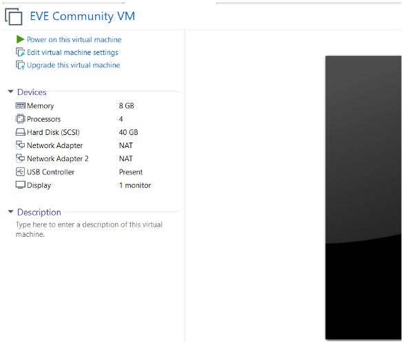

Thiết lập lại các thông số bằng việc ấn vào edit virtual… :

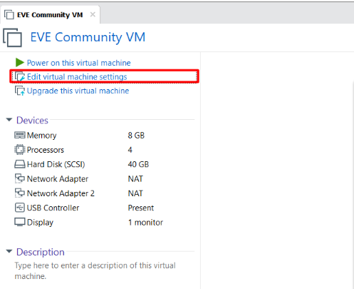

Sau khi cài xong :

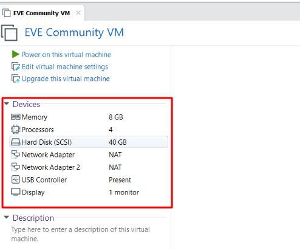

Khởi động máy tính lên :

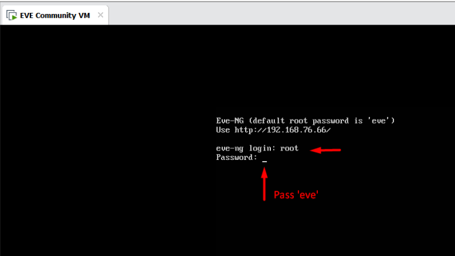

Đầu tiên là tạo lại mật khẩu cho root. Bạn cần gõ lại mật khẩu lần thứ hai để xác nhận:

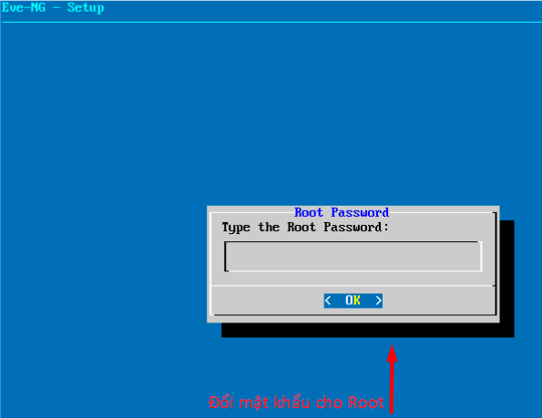

Đặt lại tên máy chủ cho máy chủ ảo:

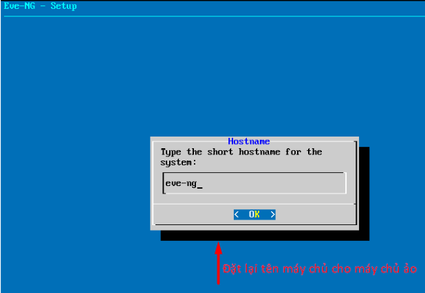

Cấu hình domain DNS cho máy ảo (gõ domain tùy ý):


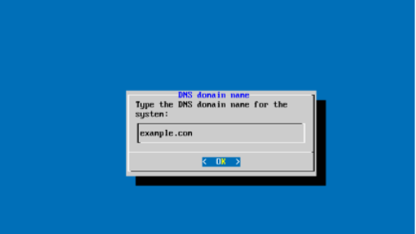

Cấu hình địa chỉ IP cho hệ thống (tuỳ ý người sử dụng ) :

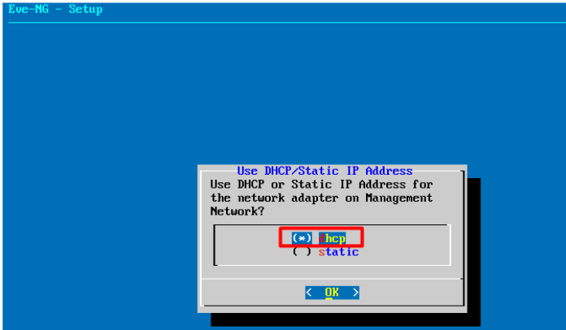


Nên cấu hình địa chỉ tĩnh để tiện cho sau này dùng trình duyệt tương tác:


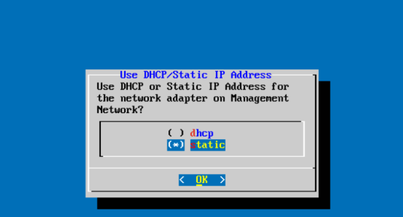

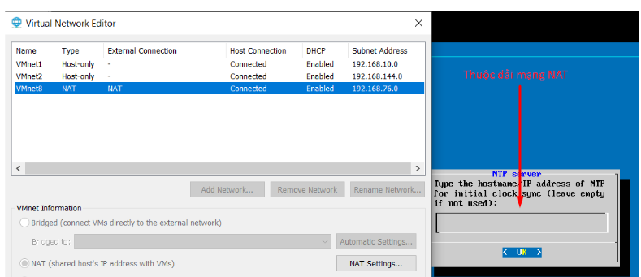

Đặt địa chỉ IP tuỳ chọn :


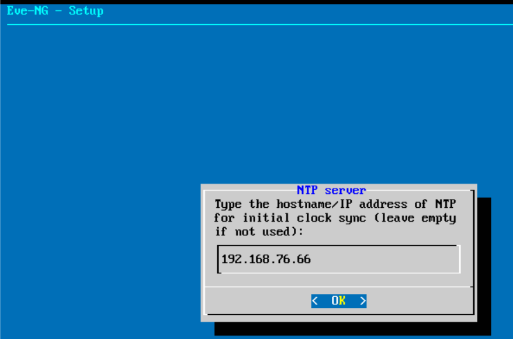

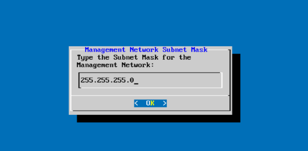

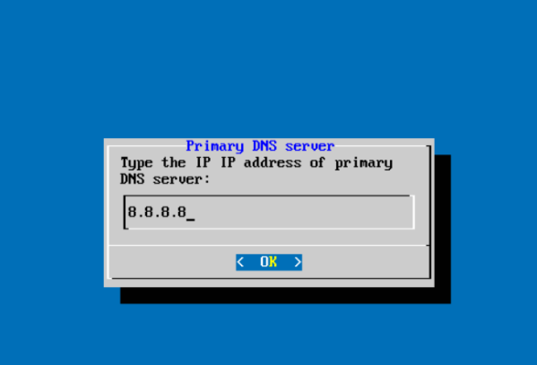

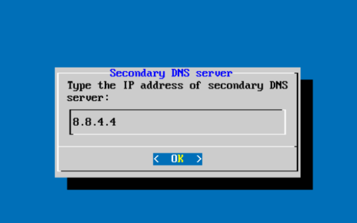

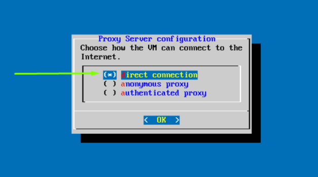

EVE-NG setup script sẽ hoàn thiện và máy ảo sẽ được khởi động ngay lập tức :

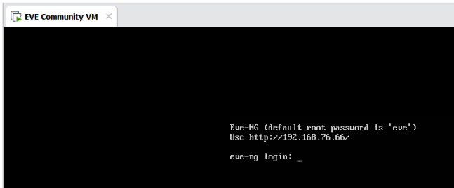

Đăng nhập lại vào hệ thống sử dụng mật khẩu mới đã đổi


#### 2.2.3 Cài đặt EVE-NG-Win-Client-pack

Link cài đặt :

https://drive.google.com/file/d/1avmi8SyQLKwTDIDciQRpAS1GxB6eoYY-/view


Thực hiện lần lượt các bước sau :

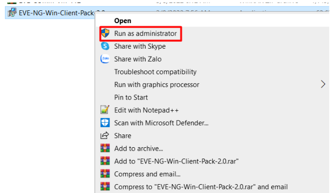
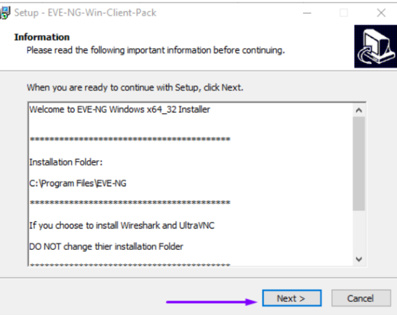

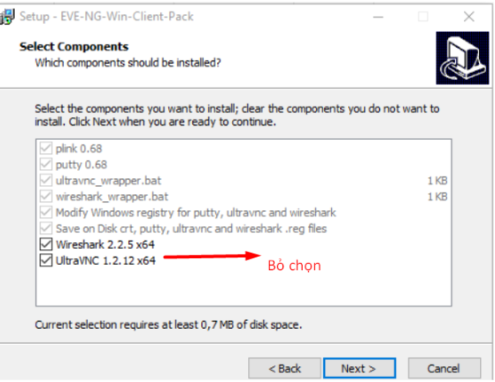

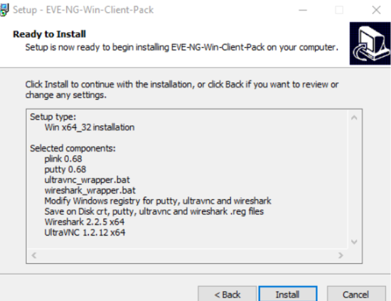
Sau đó quá trình sẽ tiến hành cài đặt thêm phần mềm wireshark để hỗ trợ việc phân tích gói tin.

Ấn next cho đến khi quá trình kết thúc
Mở trình duyệt gõ địa chỉ IP tĩnh mình cấu hình, hoặc hiện lên như hình trên được như sau là cài đặt thành công EVE-NG trên VMware Workstation:

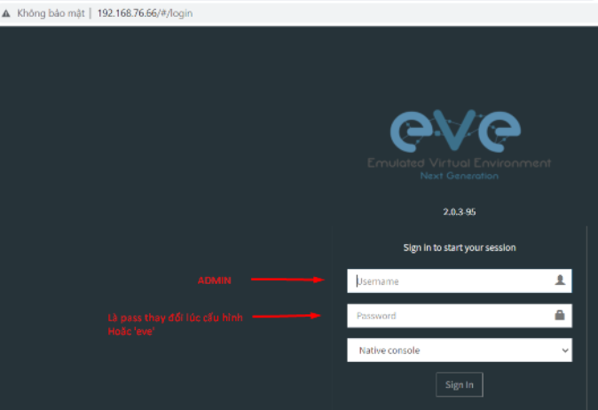


Phòng thí nghiệm lab :

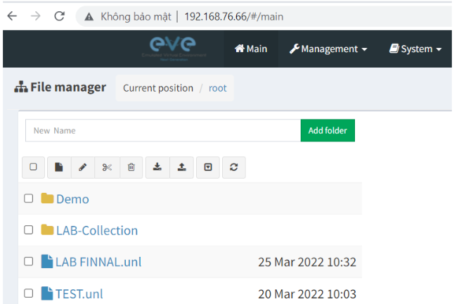

#### 2.2.4 Cài IOL-Cisco

Link cài đặt :
https://drive.google.com/drive/folders/17i5EIN6jzQDUFbBQoHrEzDD4UW0AzrWz

Tạo 1 phiên truy cập SFTP(truyền file) để tiến hành đẩy file IOL lên EVE-NG
Ở  bài hướng dẫn này sử dụng phần mềm mobaxterm :

https://docs.google.com/document/d/1zgpqxRWAXxeJ1rDiVDPEGtV6VJ5gXTvOH-q8XHPzL1s/edit?usp=sharing


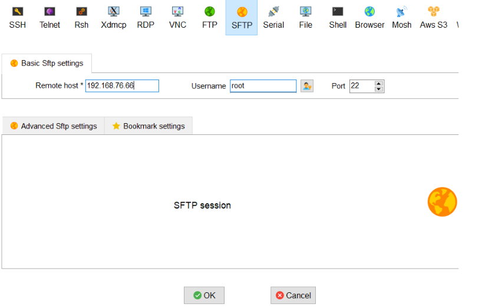


Truy cập đến đường dẫn như trong hình :

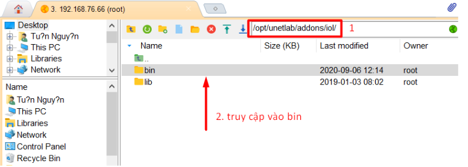

Ở bên desktop ta tìm thư mục chứa IOL bôi đen và kéo thả sang thư mục bên phải  theo đường dẫn  hoặc có thể nhấn vào biểu tượng upload :

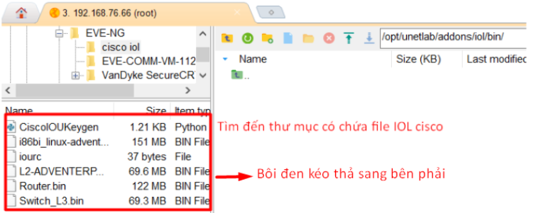
Thực hiện truy cập SSH vào EVE-NG như hướng dẫn ở cấu hình phần MobaXterm bên trên :

Gõ lệnh :
 
```
cd /opt/unetlab/addons/iol/bin
ls -l
```

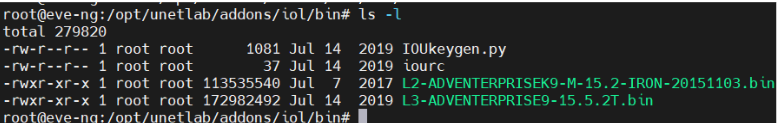

Ta thấy có đầy đủ các file cấu hình 

Tạo keygen thực hiện lệnh như sau :

```
Python CiscoIOUKeygen.py
```

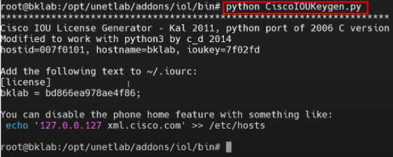


Quay lại SFTP :

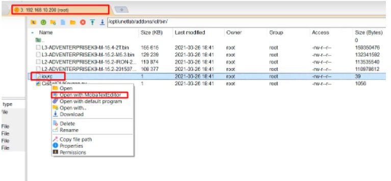

Chỉnh sửa thư mục iourc :

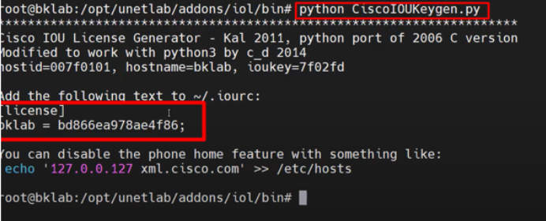

Copy keygen mới tạo và sửa :

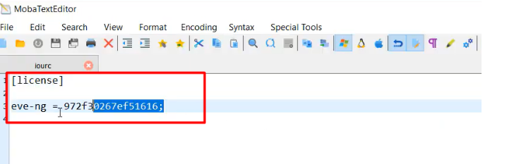


Lưu và thoát :
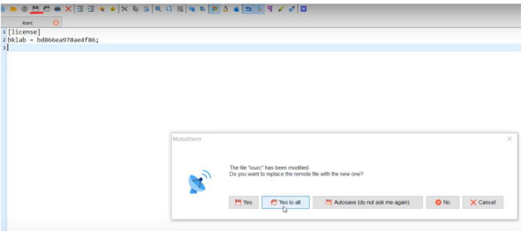

Thực hiện kiểm tra lại bằng lệnh : 

```
Cat iourc
```

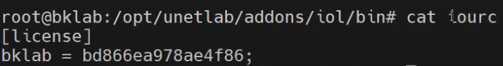


Nhập lệnh sau để sửa đổi và hoàn tất  :
Lệnh :

```
/opt/unetlab/wrappers/unl_wrapper -a fixpermissions
```

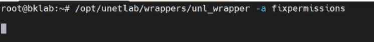

Truy cập vào trình duyệt :


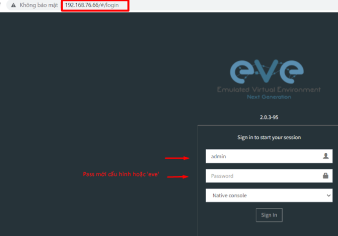


Tạo 1 bài lab đơn giản :


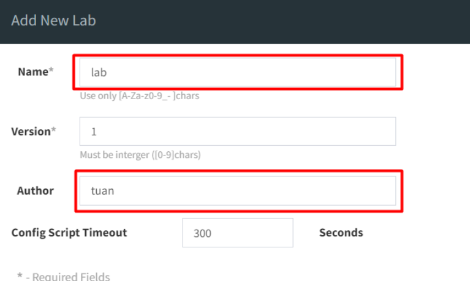


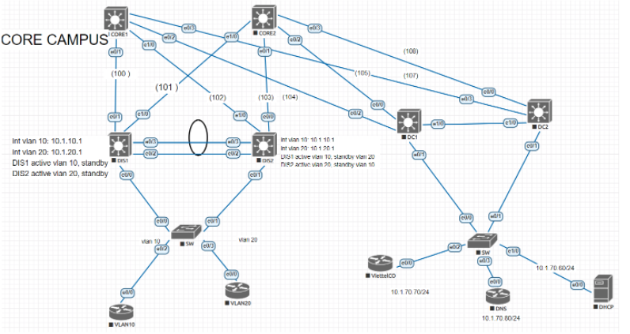


## Link các bài hướng dẫn SecureSRT,router mikrotik,VNC(tích hợp win 7 vào EVE_NG)

Các phần mềm bổ trợ để telnet và cấu hình từ xa: 

https://github.com/TuanNguyen76/TaiLieuCaNhan/blob/T%C3%A0i-li%E1%BB%87u-c%C3%A1-nh%C3%A2n/T%C3%A0i_Li%E1%BB%87u_C%C3%A1_Nh%C3%A2n/1.CCNA/01.Cac_phan_mem_bo_tro_EVE_NG.md


Tích hợp các phần mềm cần thiết để CCNA :

Mikrotk :
https://github.com/tuannt76/CCNA/blob/main/docs/0.H%C6%B0%E1%BB%9Bng_d%E1%BA%ABn_th%C3%AAm_Router_Mikrotik_v%C3%A0o_EVE-NG.md

PC win 7 :
https://github.com/tuannt76/CCNA/blob/main/docs/0.H%C6%B0%E1%BB%9Bng_d%E1%BA%ABn_th%C3%AAm_m%C3%A1y_%E1%BA%A3o_Win_7_v%C3%A0o_EVE_NG.md


