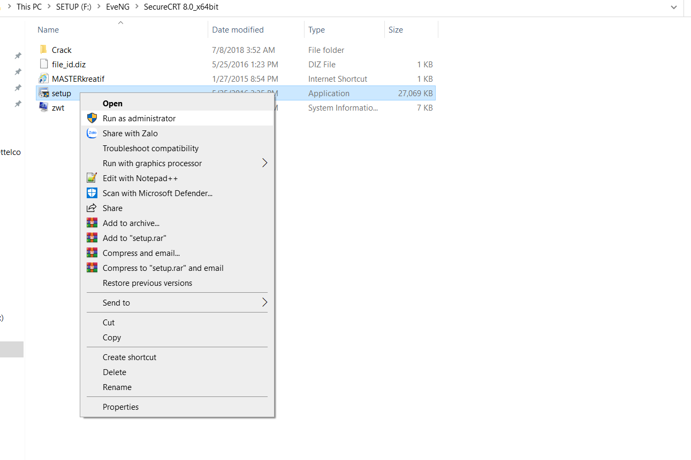

# Hướng dẫn cài các phần mềm bổ trợ EVE :

- [Hướng dẫn cài các phần mềm bổ trợ EVE :](#hướng-dẫn-cài-các-phần-mềm-bổ-trợ-eve-)
  - [1.Cài  SecureCRT](#1cài--securecrt)
  - [2.Cài Đặt mobaxterm :](#2cài-đặt-mobaxterm-)

## 1.Cài  SecureCRT
- link cài đặt :
https://drive.google.com/file/d/18YPi_7Bkm84nnvwBJsDfRawwhzU-NmV9/view?usp=sharing





- Xong quá trình cài đặt SecureCRT.Chúng ta tiến hành crack.Mở file thư mục ban đầu :


- Xuất hiện giao diện của phần mềm crack :

- lần lượt làm theo hình :

- Tìm đường dẫn đến Securecrt : 
C:\Program Files\VanDyke Software\SecureCRT 
- Lần lượt click theo thứ tự :

Tiếp tục :


- Lần lượt làm theo hình :


- Lần lượt copy các thông tin bên hình phải và paste sang trái  nhớ bỏ [  :


- Sau khi hoàn thành lần lượt làm theo hình : 


- Hoàn thành quá trình cài SecureCRT và crack
- Bước tiếp theo ta sẽ sửa đường dẫn để có secureCRT Telnet được :
- Ta truy cập : window + gõ Registry Editor


- Ta truy cập lần lượt từng thư mục trong hình theo thứ tự 1,2,3 :


- Tìm đến thư mục Putty telnet trong thư mục classes :

```
Computer\HKEY_CURRENT_USER\SOFTWARE\Classes\Putty.telnet\shell\open\command
```


- Sửa đường dẫn thư mục Putty Telnet bằng đường dẫn như trong hình dưới   :
```
C:\Program Files\VanDyke Software\SecureCRT\SecureCRT.exe
```


- Ấn ok :


- Tiếp tục tìm đến thư mục ``Telnet `` trong mục classes :

```
Computer\HKEY_CURRENT_USER\SOFTWARE\Classes\telnet\shell\open\command
```

- Sửa đường dẫn thư mục bằng đường dẫn như trong hình dưới  :

```
C:\Program Files\VanDyke Software\SecureCRT\SecureCRT.exe
```


- Xong quá trình sửa đường dẫn 


- Truy cập vào this pc và sang phần view tìm đến option như trong ảnh và chỉnh sửa :


- Truy cập theo đường dẫn This PC…Như hình bên dưới để sửa file cấu hình :
C:\Users\ngoct\AppData\Roaming\VanDyke\Config
Ngoct là tên user


- Truy cập vào trình duyệt WEB và tạo 1 bài lab đơn giản :


Điền các thông tin bài lab và ấn save :


- 1 phòng thí nghiệm lab hiện ra ta sẽ thêm các note :


- Ta tạo 1 bài lab đơn giản để kiểm tra SecureCRT hoạt động chưa :
chuột phải bật nút cho Router hoạt động :


- Thành công chúng ta đã có công cụ để cấu hình :


## 2.Cài Đặt mobaxterm :

https://mobaxterm.mobatek.net/download-home-edition.html

Tiến hành tải về giải nén và next, next, next,....cho đến khi quá trình hoàn thành 

