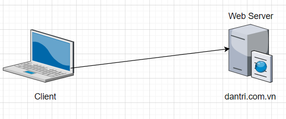
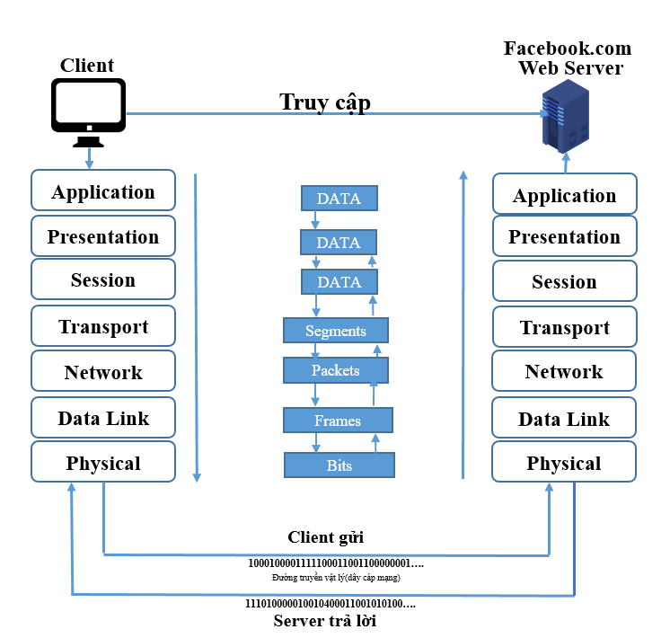
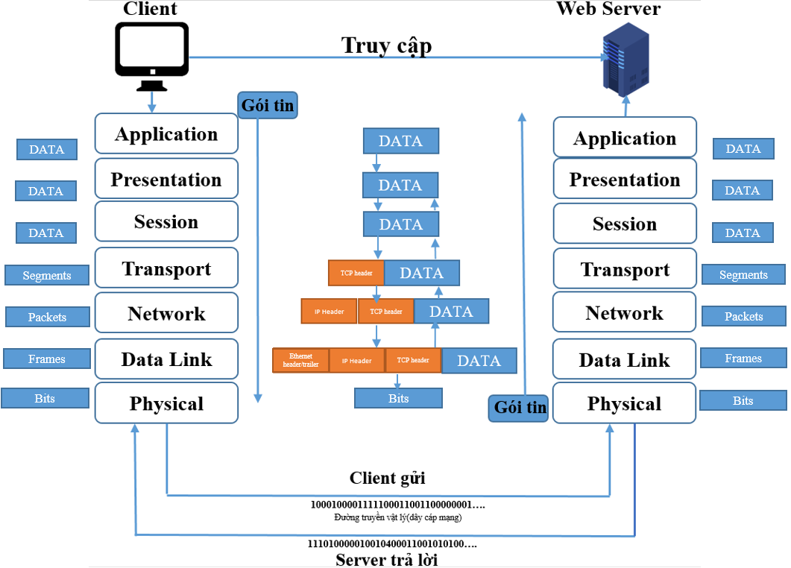

# Tổng quan mô hình OSI

- [Tổng quan mô hình OSI](#tổng-quan-mô-hình-osi)
- [1.Đặt vấn đề:](#1đặt-vấn-đề)
- [2. Cách hoạt động mô hình OSI :](#2-cách-hoạt-động-mô-hình-osi-)
- [3. Tổng quan các tầng trong mô hình OSI](#3-tổng-quan-các-tầng-trong-mô-hình-osi)
  - [3.1. Tầng ứng dụng (Application layer)](#31-tầng-ứng-dụng-application-layer)
  - [3.2. Tầng trình diễn (Presentation layer)](#32-tầng-trình-diễn-presentation-layer)
  - [3.3. Tầng phiên (Session layer)](#33-tầng-phiên-session-layer)
  - [3.4. Tầng giao vận (Transport layer)](#34-tầng-giao-vận-transport-layer)
  - [3.5 Tầng mạng (Network layer)](#35-tầng-mạng-network-layer)
  - [3.6 Tầng liên kết dữ liệu (Data link layer)](#36-tầng-liên-kết-dữ-liệu-data-link-layer)
  - [3.7. Tầng vật lý (Physical layer)](#37-tầng-vật-lý-physical-layer)
- [4.Thông tin thêm về mô hình OSI](#4thông-tin-thêm-về-mô-hình-osi)
- [5.Tóm tắt Day1](#5tóm-tắt-day1)


# 1.Đặt vấn đề:
> 1. Mô hình OSI

**( 1 người "trắng tinh" chưa biết về mạng thì phần Đặt vấn đề này rất quan trọng để nó giúp ta có cái nhìn bao quát về giao thức mạng(Interter protocol) viết tắt là IP và chúng ta có thể đi sâu vào những phần tiếp theo )**

**xuyên suốt quá trình này sẽ viết theo 1 ngôn ngữ dễ hiểu nhất để mọi người dễ hình dung**

**Khái niệm lên mạng,lướt web chúng ta vẫn hay nói hàng ngày?**

- Bản chất việc lên mạng tức là mỗi chúng ta có 1 hay nhiều thiết bị có kết nối mạng (ĐT thông minh, máy tính,..v.v..) mỗi tháng chúng ta phải trả tiền mạng cho các nhà cung cấp dịch vụ Intenert(WIFI có thể là viettel,FPT,VNPT,gói cước điện thoại mobifone,Viettel.v.v...),và lên mạng tức là chúng ta sẽ kết nối vs 1 thiết bị khác để lấy dữ liệu về,....
  


  - Ví dụ : cụ thể mình hay đọc báo và vào web ``Facebook.com`` thì chúng ta phải kết nối vào 1 máy chủ có tên là ``facebook.com`` để có thể đọc báo ở trên máy chủ đó , máy chủ còn được gọi là server,...server là (máy chủ) bản chất là máy tính, nhưng nó không phải là máy tính bình thường mà là siêu máy tính có rất nhiều RAM,CPU,... 
  - Server có thể chứa dữ liệu và cung cấp nôi dung cho hàng triệu người, tỉ người kết nối vào và tải về....

  - Chúng ta trò chuyện,xem video cũng là đang truy cập vào máy chủ facebook,youtube....
  
**Tại sao các thiết bị ``có thể kết nối`` đến máy chủ dân trí nói trên ?**

- Người bình thường không cần biết? Nhưng chúng ta học mạng thì phải biết về mô hình OSI(mô hình truyền thông) ?
    
- Mô hình truyền thông giải quyết vấn đề **dữ liệu điện thoại và máy chủ** ấy sẽ truyền với nhau như nào, đi đến được máy chủ đích như thế nào(ví dụ dữ liệu đi đến đươc máy chủ Facebook ở bên Mỹ thì nó sẽ đi như nào) ?
  
- Mô hình OSI sinh ra 7 lớp để giải quyết dữ liệu(hoặc gói tin) chúng ta gửi đi sẽ như nào.

- Nó sẽ chia ra 7 lớp để giải quyết bao gồm 7 lớp để giải quyết vấn đề trên :

                  1.  Application
                  2.  Presentation
                  3.  Session
                  4.  Transport
                  5.  Network
                  6.  Datalink
                  7.  Physical





Ngoài mô hình ```OSI``` thì chúng ta có mô hình khác tương tự là mô hình ```TCP/IP``` . 

Bản chất 2 mô hình ```tương tự nhau`` nhưng mỗi mô hình sẽ giải quyết 1 vấn đề khác nhau .

**Ở phần 1** này chúng ta sẽ học về vấn đề này:

**Hiểu biết được *chi tiết* 2 máy tính "nói chuyện" với nhau như nào.**

# 2. Cách hoạt động mô hình OSI :


**Bước 1**: Ở tầng Application (tầng 7), người dùng tiến hành đưa thông tin cần gửi vào máy tính. Các thông tin này thường có dạng như: hình ảnh, văn bản,…

 Sau đó thông tin dữ liệu này được chuyển xuống tầng Presentation (tầng 6) để chuyển các dữ liệu thành một dạng chung để mã hóa dữ liệu và nén dữ liệu.

Dữ liệu tiếp tục được chuyển xuống tầng Session (Tầng 5). Tầng này là tầng phiên có chức năng bổ sung các thông tin cần thiết cho phiên giao dịch (gửi- nhận) này


**Bước 2** : Tiếp theo, toàn bộ gói tin đang ở tầng 5 lại được đưa xuống tầng 4 (transport). Lúc này toàn bộ nội dung của gói tin lớp 7,5,6 sẽ được tầng 4 coi là 1 ``Data`` được đóng thêm một ``TCP header`` hoặc ``UDP header``  phần này sẽ được gọi là 1 ``segments``, ``segments`` chứa 2 thành phần chính ``TCP/UDP header`` và ``data``. segments sẽ được đưa xuống tầng tiếp theo là tầng 3 ``network``.

**Bước 3** : Tương tự tầng trên tầng 3 thực hiện đóng thêm 1 ``IP header`` vào ``Segments`` và được gọi với tên gọi khác ``Packet``..``Packet`` chứa ``IP header`` , ``TCP/UDP header`` và ``Data``.



    Sơ đồ mô hình OSI cơ bản 

**Bước 4**: Tương tự như trên gói tin tiếp tục được đưa xuống tầng tiếp theo lần lượt ``Datalink`` , ``physical``. Riêng ở layer 2, ``Datalink`` thì ngoài việc bọc thêm ``ethernet header`` lúc này sẽ được gọi là ``Frames`` nó còn bọc thêm phần kiểm tra lỗi ``FCS``  và  xuống lớp vật lý, đơn vị dữ liệu của lớp vật lý phải là các ``Bits``, tức là toàn bộ cấu trúc dữ liệu này sẽ được chuyển hóa thành một dòng Bit nhị phân để truyền trên đường truyền vật lý.

**Bước 5** : Ở phía đầu thu tức là ở bên ``máy chủ facebook.com`` thì quá trình lại diễn ra ``ngược lại`` tức là lúc này dòng Bit nhị phân được đưa vào đường truyền vật lý và truyền lên trên.

**Bước 6**:  Sau khi được truyền đến được máy chủ ``facebook.com`` với dãy bit `0100011000...` ở tầng `physical` thì nó sẽ được tiếp tục đẩy lên tầng trên ``Data Link`` và bóc 1 lớp gói hàng ra được gọi ``ethernet header`` ra ở tầng `Datalink` gọi là lớp Frames và tương tự đẩy lên ``Tầng Network`` và bóc lớp ``Packets`` tương tự như vậy đến tầng transport bóc ``Segrrments`` và đẩy lên tầng trên của nó.

> Tóm tắt kiến thức cần nhớ :

- Kết thúc quá trình trên hoàn thành 1 quá trình gửi dữ liệu từ người dùng đến 1 máy tính khác (ví dụ đang nói ở đây là siêu máy tính máy chủ Facebook.com),...Thông qua bước trên chúng ta sẽ hiểu rõ 1 phần nào về mô hình ``OSI``

- Trong quá trình này, người dùng gửi đi 1 đoạn văn bản hoặc hình ảnh,v.v...**sẽ được chia nhỏ thành các gói tin** và tất cả các gói tin này sẽ thực hiện các  bước trên.

# 3. Tổng quan các tầng trong mô hình OSI

## 3.1. Tầng ứng dụng (Application layer)

• Tầng ứng dụng cung cấp giao diện sử dụng cho người dùng(Chorme,mozilla firefox,...) và môi trường truyền tin.

• Thực hiện chức năng chuyển file trong đó có giải quyết vấn đề không tương thích như cách đặt tên file hay các mã điều khiển trong một tệp văn bản...

• Cung cấp các dịch vụ Electronic mail, Remote login, Directory lookup...


> Các giao thức tiêu biểu tầng Application sử dụng : HTTP,DNS ,SMTP, SNMP, FTP, NTP,NFS,SSH, Telnet,... 


## 3.2. Tầng trình diễn (Presentation layer)

• Giải quyết vấn đề liên quan tới cú pháp và ngữ nghĩa của thông tin như chuyển đổi thông tin theo một chuẩn nào đó được cả hai bên sử dụng (mã ASCII - EDBCDIC).

• Nén/giãn dữ liệu để giảm số lượng bit truyền trên mạng.

• Mã hoá dữ liệu để thực hiện quyền truy cập.

> Các giao thức tiêu biểu tầng Presentation sử dụng : XDR, ASN.1, SMB, AFP, NCP
## 3.3. Tầng phiên (Session layer)

- Tầng này cho phép người sử dụng trên các máy khác nhau thiết lập, duy trì, huỷ bỏ, đồng bộ phiên truyền thông giữa họ. 
- Cung cấp một số dịch vụ hữu ích cho người sử dụng như cho phép người dùng login vào hệ thống chia sẻ thời gian, truyền tệp giữa các máy tính.
- Quản lý token: cơ chế thẻ bài được tầng phiên cung cấp để tránh hiện tượng tranh chấp đường truyền trên mạng.
- Thực hiện đồng bộ (Synchronization): thực hiện đối với những dữ liệu lớn bằng cách thêm vào các thông tin kiểm tra, sửa lỗi.

> Các giao thức tiêu biểu tầng Session sử dụng :ASAP, TLS,  ISO 8327 / CCITT X.225, RPC, NetBIOS, ASP

## 3.4. Tầng giao vận (Transport layer)

- Kiểm soát việc truyền tin từ nút tới nut (end-to-end): Bắt đầu từ tầng này,các thực thể đã có thể nói chuyện một cách logic với nhau.
- Thực hiên việc ghép kênh và phân kênh: Mỗi ứng dụng có thể gửi dữ liệu đi theo nhiều con đường, một đường truyền lại có thể được nhiều ứng dụng sử dụng, phân kênh/hợp kênh giải quyết vấn đề phân chia dữ liệu cho các ứng dụng.

- Khắc phục sai sót trong quá trình truyền tin: Việc khắc phục sai sót được thực hiện trên nhiều tầng khác nhau, nhưng hiệu quả nhất là ở các tầng cao, việc khắc phục sai sót làm ở tầng giao vận là hợp lý nhất.

> Các giao thức tiêu biểu tầng Transport sử dụng :TCP, UDP, RTP, SCTP, SPX, ATP, IL

## 3.5 Tầng mạng (Network layer)
- Vấn đề chủ chốt của tầng mạng là dẫn đường(định tuyến), định rõ các gói tin (packet) được truyền theo những con đường nào từ nguồn đến đích. 
- Các con đường này có thể cố định, ít bị thay đổi,được thiết lập khi bắt đầu liên kết hay động (dynamic) thay đổi tuỳ theo trạng thái tải của mạng.

- Nếu có nhiều gói tin truyền trên mạng có thể xảy ra tình trạng tắc nghẽn,tầng mạng phải giải quyết vấn đề này.

- Thực hiện chức năng giao tiếp với các mạng bao gồm việc đánh lại địa chỉ,cắt hợp gói tin cho phù hợp với các mạng.
- Thực hiện kiểm tra đường truyền có ổn định hay không,xác định đường đi từ nguồn tới đích của một gói Giao thức mạng Internet (IP - Internet Protocol)
- Ngoài ra tầng mạng còn thực hiện một số chức năng kế toán, ví dụ, một số Firewall (packet filtering) được cài đặt trên tầng này để thống kê số lượng các gói tin truyền qua mạng hay ngăn cấm hoặc cho phép các gói tin của giao thức nào đó.

> Các giao thức tiêu biểu tầng Network sử dụng :IP, ICMP, IGMP, IPX, BGP, OSPF, RIP, IGRP, EIGRP, ARP, RARP, X.25

## 3.6 Tầng liên kết dữ liệu (Data link layer)

- Liên kết, thiết lập, duy trì, huỷ bỏ các liên kết dữ liệu là nhiệm vụ của tầng
data link.

- Ngoài ra tầng data link còn kiểm soát lỗi đường truyền, thông lượng.
- Tầng này thực hiện việc đóng gói thông tin gửi thành các frame, gửi các frame một cách tuần tự đi trên mạng, xử lý các thông báo xác nhận (Acknowledgement frame) do bên nhận gửi về. 
- Xác định ranh giới giữa các frame bằng cách ghi một số byte đặc biệt vào đầu và cuối frame. 
- Giải quyết vấn đề thông lượng truyền giữa bên gửi và bên nhận (Vấn đề này có thể được giải quyết bởi một số lớp trên).

> Các giao thức tiêu biểu tầng Data link sử dụng : Ethernet, Token ring, HDLC, Frame relay, ISDN, ATM, 802.11 WiFi, FDDI, PPP

## 3.7. Tầng vật lý (Physical layer)

• Tầng vật lý liên quan tới việc truyền dòng bit giữa các máy bằng kênh truyền thông vật lý, ở đây, cấu trúc của dữ liệu không được quan tâm đến.

• Việc thiết kế tầng vật lý cần quan tâm đến các vấn đề về ghép nối cơ khí,điện tử, thủ tục và môi trường truyền tin bên dưới nó ví dụ mức điện áp
tương ứng với bit 0 - 1, thời gian tồn tại của xung...

Tầng vật lý :	10BASE-T, 100BASE-T, 1000BASE-T, SONET/SDH, T-carrier/E-carrier, các tầng vật lý khác thuộc 802.11


# 4.Thông tin thêm về mô hình OSI 

- Mô hình mạng máy tính do tổ chức tiêu chuẩn hoá quốc tế (International Standard Organization - ISO) đưa ra năm 1983 được gọi là mô hình tham chiếu các hệ thống mở (Open Systems Interconect referent model - OSI).

- Mô hình OSI ra đời sau khi các giao thức TCP/IP đã được sử dụng rộng rãi, nhiều công ty đã đưa ra các sản phẩm TCP/IP, vì vậy, mô hình OSI chỉ được sử dụng trong thực tế như một chuẩn về lý thuyết.

- Các điều khoản mô tả trong mô hình được sử dụng rộng rãi trong lý thuyết truyền thông, do đó, trong thực tế khó có thể nói về truyền thông mà không sử dụng thuật ngữ của OSI.


- Bản thân OSI không phải là một kiến trúc mạng bởi vì nó không chỉ ra chính xác các dịch vụ và các nghi thức được sử dụng trong mỗi tầng. Mô hình này chỉ ra mỗi tầng cần thực hiện nhiệm vụ gì. ISO đã đưa ra các tiêu chuẩn cho từng tầng, nhưng các tiêu chuẩn này không phải là một bộ phận của mô hình tham chiếu.

- Trong mô hình OSI, một số chức năng như điều khiển thông lượng, kiểm tra lỗi xuất hiện lặp lại trong một số tầng. Điều này có nguyên nhân do mô hình OSI được chia làm các tầng khác nhau, mỗi tầng tương ứng với một đối tượng độc lập (có dữ liệu và các phương thức riêng của nó, độc lập với các đối tượng khác).
- Mô hình quá phức tạp cho việc cài đặt làm cho OSI khó có thể ứng dụng rộng rãi trên thực tế.

# 5.Tóm tắt Day1

**Những phần ta cần lắm được**:

  - Hiểu được 2 máy tính nói chuyện với nhau như thế nào 1 cách cơ bản nhất.
  - Nắm cơ bản nhiệm vụ chức năng và các giao thức của các tầng trong mô hình OSI

Bài tiếp theo:

[CCNA_day_2_Mô_hình_OSI](/Tài_Liệu_Cá_Nhân/1.CCNA/CCNA_day_2_(Mô_Hình_OSI).md)


     
