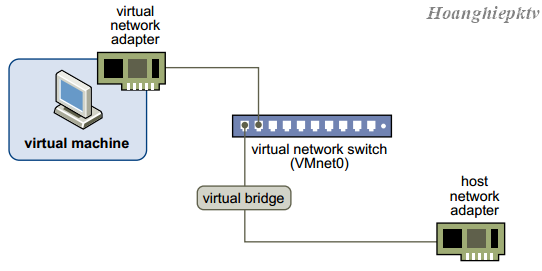
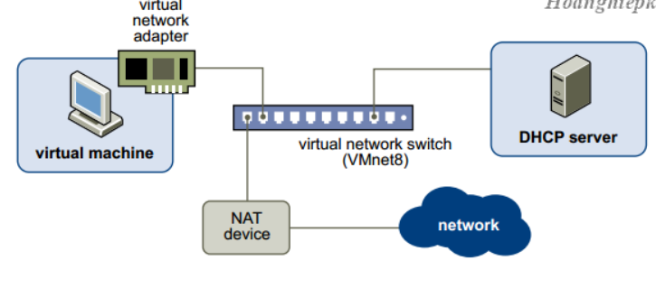
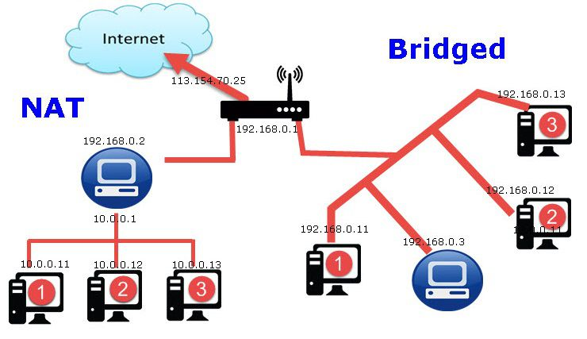

**Các loại card mạng** 

- [**1.Bridge**](#1bridge)
- [**2.NAT**](#2nat)
- [**3.LAN Segment:**](#3lan-segment)
- [**4.Host - Only**](#4host---only)

# **1.Bridge**
Card này sử dụng chính card mạng thật của chúng ta để kết nối ra ngoài Internet (card ethernet hoặc wireless). Do đó khi sử dụng card mạng này IP của máy ảo sẽ cùng với dải IP của máy thật.
` `Ở chế độ này, card mạng trên máy ảo được gắn vào VMnet0, VMnet0 này liên kết trực tiếp với card mạng vật lý trên máy thật.

Máy ảo chung môi trường kết nối switch (layer 2) với các máy thật.

# **2.NAT**
Giống như mạng gia đình của bạn có bộ định tuyến không dây, VM sẽ được chỉ định trong một mạng con riêng, giống như 192.168.6.1máy chủ của bạn và VM là 192.168.6.3, sau đó VM của bạn có thể truy cập mạng bên ngoài như máy chủ của bạn, nhưng không có quyền truy cập bên ngoài vào VMWare của bạn trực tiếp, nó được bảo vệ.

Card NAT chỉ có thể giao tiếp với card mạng ảo VMnet8 trên máy thật.

Card NAT chỉ có thể giao tiếp với các card NAT trên các máy ảo khác.

Card NAT không thể giao tiếp với mạng vật lý mà máy tính thật đang kết nối. Tuy nhiên nhờ cơ chế NAT được tích hợp trong VMWare, máy tính ảo có thể gián tiếp liên lạc với mạng vật lý bên ngoài.
# **3.LAN Segment:**

Các card mạng của máy ảo có thể gắn kết với nhau thành từng LAN Segment. Không giống như VMnet, LAN Segment chỉ kết nối các máy ảo được gán trong một LAN Segment lại với nhau mà không có những tính năng như DHCP và LAN Segment không thể kết nối ra máy thật như các Virtual Switch VMnet.
# **4.Host - Only**

\- máy ảo được kết nối với VMnet có tính năng Host-only, trong trường hợp này là VMnet1.VMnet Host-only kết nối với  một card mạng ảo tương ứng ngoài máy thật

\- Hai máy ảo thấy được nhau.(Card Host-only chỉ có thể giao tiếp với card mạng ảo VMnet1 trên máy thật)

\- Các máy ảo và máy thật thấy được nhau.

\- Card Host-only chỉ có thể giao tiếp với các card Host-only trên các máy ảo khác.

\- Card Host-only không thể giao tiếp với mạng vật lý mà máy tính thật đang kết nối.

\- Mặc định các máy ảo không có khả năng kết nối internet, có nghĩa là mạng VMnet Host-only và mạng vật lý hoàn toàn tách biệt.

\- IP của máy ảo được cấp bởi DHCP của VMnet tương ứng, ta có thể tắt DHCP trên VMnet và cấu hình IP bằng tay cho máy ảo.

