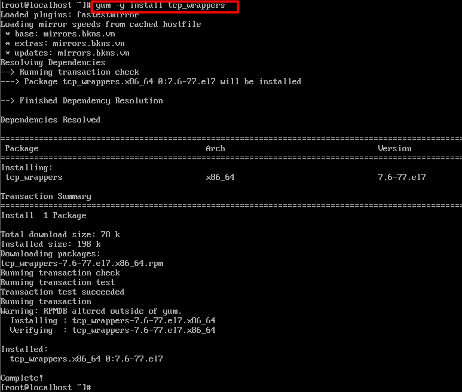

**Tìm hiểu TCP wrapper**
- [**1.TCP Wrappers là gì ?**](#1tcp-wrappers-là-gì-)
  - [**1.1 Khái niệm**](#11-khái-niệm)
  - [`	`**1.2 Ưu điểm của TCP Wrappers?**](#12-ưu-điểm-của-tcp-wrappers)
- [**2. Quy trình làm việc của TCP Wrappers**](#2-quy-trình-làm-việc-của-tcp-wrappers)
- [**3.Cài đặt TCP Wrappers**](#3cài-đặt-tcp-wrappers)
- [**4.Hạn chế quyền truy cập vào máy chủ Linux bằng cách sử dụng TCP Wrappers**](#4hạn-chế-quyền-truy-cập-vào-máy-chủ-linux-bằng-cách-sử-dụng-tcp-wrappers)
  - [**4.1 Cú pháp**](#41-cú-pháp)
  - [**4.2 Bảo mật máy chủ**](#42-bảo-mật-máy-chủ)
    - [**4.2.1 Chặn tất cả các kết nối đến và chỉ cho phép một vài máy chủ hoặc mạng cụ thể.**](#421-chặn-tất-cả-các-kết-nối-đến-và-chỉ-cho-phép-một-vài-máy-chủ-hoặc-mạng-cụ-thể)
    - [**4.2.2 Cho phép tất cả các máy chủ ngoại trừ một máy chủ cụ thể**](#422-cho-phép-tất-cả-các-máy-chủ-ngoại-trừ-một-máy-chủ-cụ-thể)

# **1.TCP Wrappers là gì ?**
## **1.1 Khái niệm**
- TCP Wrappers bảo vệ các dịch vụ Linux và bảo vệ các dịch vụ giao tiếp bằng giao thức TCP.
- ` `Nó thực sự hữu ích và rất quan trọng vì nó cung cấp cho bạn một lớp bảo vệ bổ sung, đặc biệt là đối với những dịch vụ, chẳng hạn như FTP, mà bạn KHÔNG thể giới hạn quyền truy cập bằng địa chỉ IP trong tệp cấu hình chính.
- TCP Wrappers chặn truy cập các dịch vụ trên máy chủ Linux của bạn thông qua hạn chế các IP.
## `	`**1.2 Ưu điểm của TCP Wrappers?**
`		`Ưu điểm:

- Tính minh bạch đối với cả máy khách và dịch vụ mạng được bảo vệ.Người dùng hợp pháp được đăng nhập và kết nối với dịch vụ được yêu cầu trong khi kết nối từ các máy khách bị cấm không thành công.
- Quản lý tập trung nhiều giao thức - TCP Wrappers hoạt động riêng biệt với các dịch vụ mạng mà chúng bảo vệ, cho phép nhiều ứng dụng máy chủ chia sẻ một tập hợp chung các tệp cấu hình kiểm soát truy cập, giúp quản lý đơn giản hơn.
# **2. Quy trình làm việc của TCP Wrappers**
Bước 1: Khi một kết nối được thực hiện với một dịch vụ bởi TCP, trước tiên nó sẽ tham chiếu đến các tệp truy cập của máy chủ

`  `/etc/hosts.allow**  và /etc/hosts.deny

` `để xác định xem máy khách có được phép kết nối hay không. Sau đó nó sử dụng daemon nhật ký hệ thống ( syslogd) để viết tên của ứng dụng khách yêu cầu và dịch vụ được yêu cầu vào /var/log/secure hoặc /var/log/messages.

Bước 2: Nếu một máy khách được phép kết nối, TCP Wrappers giải phóng quyền kiểm soát kết nối đến dịch vụ được yêu cầu và không tham gia thêm vào giao tiếp giữa máy khách và máy chủ.
# **3.Cài đặt TCP Wrappers**
`	`Lệnh cài trên CentOS 7:

```
yum -y install tcp\_wrappers
```




# **4.Hạn chế quyền truy cập vào máy chủ Linux bằng cách sử dụng TCP Wrappers**
## **4.1 Cú pháp**
Cú pháp của các tệp này như sau:


|list\_of\_service : list\_of \_ client [:lệnh \_ shell ]|
| - |


Trong đó:

●        service \_ list là danh sách các tên tiến trình của trình nền cần xem xét.

●        client \_ list là danh sách tên máy chủ, địa chỉ IP, mẫu đặc biệt hoặc ký tự đại diện sẽ được so sánh với từng máy khách được kết nối.
## **4.2 Bảo mật máy chủ**
### **4.2.1 Chặn tất cả các kết nối đến và chỉ cho phép một vài máy chủ hoặc mạng cụ thể.**
Bước 1: gõ lệnh để chỉnh sửa tệp deny:

|sudo vi /etc/hosts.deny|
| - |

●  	Thêm dòng (dòng này từ chối kết nối với tất cả các dịch vụ và tất cả các mạng):

|ALL: ALL|
| - |
` `Bước 2: Gõ lệnh để chỉnh sửa tệp allow :

|sudo vi /etc/hosts.allow|
| - |

●  	Thêm địa chỉ mạng cụ thể muốn kết nối:

|sshd : 192.168.10.40|
| - |

●  gõ lệnh sau để xem các tệp nhật ký 


|cat /var/log/secure|
| - |

### **4.2.2 Cho phép tất cả các máy chủ ngoại trừ một máy chủ cụ thể**
●  	Cho phép kết nối từ các IP trong dải 192.168.10 ,trừ IP 192.168.10.69

●  	Gõ lệnh sau vào tệp /etc/hosts.allow :


|ALL: 192.168.184. EXCEPT 192.168.184.192|
| - |


