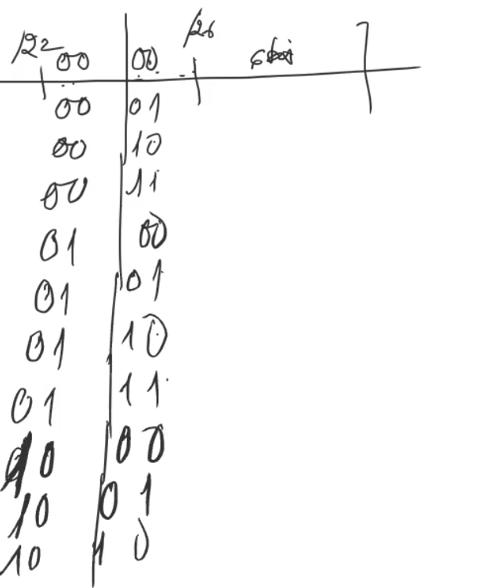

Ip(Internet Protocol)

- [**1.Ip là gì**](#1ip-là-gì)
- [**2.Các loại địa chỉ IP**](#2các-loại-địa-chỉ-ip)
  - [**2.1 Ip tĩnh(ip Static)**](#21-ip-tĩnhip-static)
  - [**2.2 Ip động(IP Dynamic)**](#22-ip-độngip-dynamic)
  - [**2.3 Ip public**](#23-ip-public)
  - [**2.4 Ip private**](#24-ip-private)
- [**3. Ipv4(*Internet Protocol version 4)***](#3-ipv4internet-protocol-version-4)
  - [3.1 Cấu trúc địa chỉ IP](#31-cấu-trúc-địa-chỉ-ip)
  - [3.2 IP Packet heade](#32-ip-packet-heade)
  - [**3.2 Các lớp của địa chỉ IPv4**](#32-các-lớp-của-địa-chỉ-ipv4)
    - [***Lớp A***](#lớp-a)
    - [***Lớp B***](#lớp-b)
    - [***Lớp C***](#lớp-c)
    - [***Lớp D***](#lớp-d)
    - [***Lớp E***](#lớp-e)
  - [**3.3 Broadcast**](#33-broadcast)
  - [**3. Default Gateway**](#3-default-gateway)
  - [**3.6 Subnet mask**](#36-subnet-mask)
    - [**Thuật toán ANDING**](#thuật-toán-anding)
  - [**3.8 chia địa chỉ ipv4**](#38-chia-địa-chỉ-ipv4)
    - [**3.8.1 Chia đều**](#381-chia-đều)
    - [**3.8.2 Chia tối ưu**](#382-chia-tối-ưu)
# **1.Ip là gì**
là địa chỉ giao thức của internet, nó tương tự như địa chỉ nhà hay địa chỉ doanh nghiệp. Các thiết bị phần cứng trong mạng muốn kết nối và giao tiếp với nhau được đều phải có địa chỉ IP.Là địa chỉ số mà mọi thiết bị kết nối mạng có được để chia sẻ dữ liệu với các thiết bị khác thông qua giao thức kết nối Internet.

# **2.Các loại địa chỉ IP**
- Tùy vào mục đích sử dụng mà địa chỉ IP được phân làm: 
- Địa chỉ IP công cộng – IP Public, 
- IP Private – địa chỉ IP riêng, địa chỉ IP tĩnh – Static IP và Dynamic IP – địa chỉ IP động. 
  
Chúng có thể được phân là IPv4 hoặc IPv6, cả IP Public và IP Private đều tồn tại dưới dạng IP động hay IP tĩnh.

## **2.1 Ip tĩnh(ip Static)** 
- IP Static hay còn gọi là IP tĩnh, đây là cách đặt IP cho từng thiết bị hoàn toàn thủ công và không bị thay đổi theo thời gian
## **2.2 Ip động(IP Dynamic)**
IP Dynamic là IP động, có nghĩa rằng địa chỉ IP của máy tính có thể thay đổi, hôm nay là A thì ngày mai lại là B. Điều này xảy ra hoàn toàn tự động và được quản lý bởi máy chủ được gọi là DHCP Server.
## **2.3 Ip public**
IP public là địa chỉ IP công cộng được nhà cung cấp dịch vụ internet(viettel,vnpt,fbt,...) cung cấp.

- mọi thiết bị đang truy cập Internet đều sử dụng một địa chỉ IP duy nhất. 

- Trong thực tế, một địa chỉ IP Public đôi khi được gọi là IP Internet.

- là địa chỉ mà mỗi nhà cung cấp dịch vụ Internet (ISP) sử dụng để chuyển tiếp các yêu cầu Internet đến một gia đình hoặc doanh nghiệp có địa chỉ cụ thể.
- Bạn không thể ẩn địa chỉ IP Public của mình khỏi ISP vì tất cả lưu lượng truy cập của bạn phải di chuyển qua ISP trước khi tiếp cận bất kỳ địa chỉ nào khác trên Internet. Tuy nhiên, bạn có thể ẩn địa chỉ IP của bạn khỏi các trang web bạn truy cập bằng cách lọc tất cả dữ liệu của bạn thông qua mạng riêng ảo (VPN).

tìm địa chỉ ip public thiết bị của bạn google share:  what is my ip                  

- 1.55.15.198

ví dụ địa chỉ ip public:   

- 194.232.104.139

- 81.19.145.25

- 3.3.3.3

## **2.4 Ip private**
Địa chỉ IP Private (IP riêng) là địa chỉ IP được dành riêng cho việc sử dụng nội bộ trong vùng mạng của mình(ví dụ như mạng LAN) thông qua router hoặc thiết bị NAT khác, hoàn toàn cô lập với các mạng bên ngoài.

- ip private được gọi là địa chỉ ip cục bộ

- IP Private không thể kết nối với mạng internet, chỉ các thiết bị trong mạng mới có thể giao tiếp với nhau thông qua bộ định tuyến còn gọi là router

ví dụ 1: vào ``start`` gõ lệnh cmd 1 cửa sổ hiện lên ta gõ ``ipconfig`` sẽ thấy được địa chỉ ip private của thiết bị máy tính

# **3. Ipv4(*Internet Protocol version 4)***

[IPv4](https://en.wikipedia.org/wiki/IPv4) (tên tiếng anh là  ***Internet Protocol version 4***): giao thức internet phiên bản 4, là phiên bản thứ tư trong quá trình phát triển của các giao thức Internet ([IP](https://www.bkns.vn/ip-la-gi.html)). Đây là phiên bản đầu tiên của IP được sử dụng rộng rãi. 

## 3.1 Cấu trúc địa chỉ IP

- Địa chỉ IP được chia thành 2 phần là **network** (phần mạng) và phần **Host**

- Địa chỉ IP có 32 bit nhị phân và được chia thành các octet (4 cụm, 8 bit)

- Net-id là địa chỉ mạng,dùng để xác định mạng mà thiết bị kết nối vào 

- Host-id để xác định thiết bị của mạng đó.hiểu đơn giản là địa chỉ của thiết bị đó trong mạng.

Các quy tắc được áp dụng khi đặt địa chỉ IP:

1. Các bit phần mạng không được phép đặt đồng thời bằng 0
2. **Ví dụ**:
  
Không hợp lệ nếu đặt địa chỉ 0.0.0.1 với phần mạng 0.0.0 và phần Host là 1).

1. Sẽ có một địa chỉ mạng nếu các bit phần Host đồng thời có giá trị bằng 0 

(**Ví dụ** : Địa chỉ 192.168.1.1 có thể gán cho Host nhưng thay giá trị 0 vào 192.168.1.0 sẽ thành địa chỉ mạng và không thể gán cho Host).

1. Sẽ có địa chỉ Broadcast cho mạng nếu các bit phần Host đồng thời bằng 1

( **Ví dụ**: Mạng 192.168.1.0 có địa chỉ 192.168.1.255 là địa chỉ Broadcast).

## 3.2 IP Packet heade

- **Version**:
  - Kích thước 4 bit
  - Mô tả phiên bản của IP.
  - Có giá trị là 0100 (IPv4)

- **IP Header Length**:
Kích thước 4 bit
Xác định độ dài của trường IP Header

- **Differentiated Services or DiffServ (DS)**: Xác định độ dài ưu tiên mỗi gói tin IPv4(nó sẽ xác định xem cái nào lên được ưu tiên đi trước)

  - Kích thước 8 bit
  - Sử dụng để xác định mức độ ưu tiên của mỗi gói (packet).
  - Gồm
    - 6 bit đầu là trường Differentiated Services Code Point (DSCP) (DSCP).
    - 2 bit cuối cùng là các bit Explicit Congestion Notification (ECN).

- **Total Length**: (16 bit) Tổng độ dài của gói tin IPv4 (cả phần IP Header và Data).

- **Flag**: Xác định gói tin có bị phân mảnh hay không ? 
	Tác dụng : kích cỡ gói tin lớn nhất để đánh dấu gói tin khác nhau.Mỗi segment cắt ra thì phụ thuộc vào lớp dưới.Kích thước gói tin lớp 3 lớn nhất để đóng lớp 2. Khi kích cỡ lớn sẽ bị phân mảnh khi bị phân mảnh cờ Flag sẽ được bật lên.
- **Fragment offset**: Số thứ tự khi mỗi phân mảnh

- **Header Checksum** : (16 bit) Đảm bảo sự toàn vẹn của gói tin.
- **Time to Live (TTL)**:
   - Dài 8 bit
   - Sử dụng để giới hạn thời gian tồn tại của gói tin.
  - Thiết bị nguồn của gói IPv4 đặt giá trị TTL ban đầu.
  -  Giá trị này giảm đi 1 lần mỗi khi gói được xử lý bởi router. Nếu TTL giảm xuống 0, Router sẽ loại bỏ gói tin và gửi gói tin Internet Control Message Protocol (ICMP) thông báo quá thời gian tới Địa chỉ nguồn.

- **Protocol**:
  - Có độ dài 8 bit
  - Sử dụng để xác định giao thức được sử dụng trong phần dữ liệu của gói IPv4
  - Cho phép lớp mạng chuyển dữ liệu đến giao thức lớp trên thích hợp.
  - Ví dụ : TCP (6), UDP (17),...

- **Source IPv4 Address**:
  - Kích thước 32 bit
  - Đại diện cho địa chỉ IP nguồn của Packet.

- **Destination IPv4 Address**:
  - Kích thước 32 bit
  - Đại diện cho địa chỉ IP đích của Packet, xác định nơi gói tin đến.

Các trường để sắp xếp lại gói tin bị phân mảnh:
- **Identification**:
  - ID của gói tin
  - kích thước 16 bit
  - Được chọn bởi nguồn gửi của packet.
  - Nếu bị phân mảnh thì sẽ dựa giá trị để nút có thể nhóm lại các mảnh cùng 1 gói để phục hồi gói tin.
- **Flags (3 bit)**
  - Bit đầu : không dùng
  - Bit thứ 2: Cho biết gói tin có phân mảnh hay không
  - Bit thứ 3: Cho biết mảnh này có phải mảnh cuối không
**Fragment Offset (13 bit)**: Cho biết vị trí của của phân mảnh

## **3.2 Các lớp của địa chỉ IPv4**
### ***Lớp A***
- Lớp A của địa chỉ IPv4 sử dụng octet đầu làm phần mạng và 3 octet sau làm Host

- 0 luôn được chọn là bit đầu của địa chỉ lớp A

ví dụ:

- ``126`` hệ 2 là ``01111110``

- ``1`` hệ 2 là ``00000001``

- Các địa chỉ mạng lớp A gồm 1.0.0.0 => 126.0.0.0

- Mạng Lookback là 127.0.0.0

- Phần Host gồm 24 bit, mỗi mạng lớp A có 2^24  – 2 Host

### ***Lớp B***
- Hai octet đầu của địa chỉ lớp B được dùng làm phần mạng, 2 octet sau được dùng làm Host

- 1 và 0 luôn được giữ cho hai bit đầu của địa chỉ lớp B

- Địa chỉ mạng lớp B gồm 128.0.0.0 đến 191.255.0.0 (tổng cộng có 214 mạng trong lớp B)

- Một mạng lớp B có 2^16 – 2 Host vì phần Host của lớp này dài 16 bit

### ***Lớp C***
- Địa chỉ lớp C dùng 3 octet đầu làm phần mạng và octet sau làm phần Host
- 1, 1 và 0 được giữ cho ba bit đầu của địa chỉ lớp C
- Mạng lớp C bao gồm các địa chỉ 192.0.0 đến 223.255.255.0 (tổng cộng 221 mạng trong lớp C)
- Một mạng lớp C có 2^8 – 2 Host do phần Host của lớp này dài 8 bit

### ***Lớp D***
- Lớp D bao gồm các địa chỉ từ 224.0.0.0 đến 239.255.255

- Lớp D được dùng làm địa chỉ Multicast. VD: 224.0.0.5 dùng cho OSPF hay 224.0.0.9 dùng cho RIPv2

### ***Lớp E***
Gồm các địa chỉ từ dải 240.0.0.0 trở đi

Địa chỉ lớp E được dùng với mục đích dự phòng

- Lưu ý về các lớp của IPv4

- 1 đến 126: địa chỉ lớp A

- 128 đến 191: địa chỉ lớp B

- 192 đến 223: địa chỉ lớp C

- 224 đến 239: địa chỉ lớp D

- 240 đến 255: địa chỉ lớp E

## **3.3 Broadcast**

Tác dụng:

- Một địa chỉ broadcast sẽ đại diện cho tất cả các thiết bị kết nối cùng mạng. Do đó, khi một gói tin được gửi đến địa chỉ broadcast, toàn bộ các thiết bị trong mạng đều nhận được.

- Đặc điểm :
  - Địa chỉ có toàn bộ các bit phần ``Host_id`` là 1
  - Đại diện cho toàn bộ các thiết bị kết nối trong cùng mạng
  - Đây là địa chỉ đặc biệt nên sẽ không được sử dụng với mục đích khác

Ví dụ: 192.168.10.255/24 là địa chỉ Broadcast của vùng mạng 192.168.10.0/24.

## **3. Default Gateway**

- Default Gateway bản chất là một địa chỉ IP

- Còn được gọi là cổng mặc định của mạng máy tính.

- Mặc định sẽ là địa chỉ đầu tiên trong dải mạng hoặc do mình tự cài 1 địa chỉ bất kì trong dải mạng.
  
-  Tượng tự như các thiết bị khác nó cũng cần 1 địa chỉ để có thể giao tiếp trong mạng ``Lan`` hoặc mạng ``local`` và ngoài ra khi ra bên ngoài ``Intenet`` nó cũng cần có 1 địa chỉ để giao tiếp.
  
- Tại sao cần Default Gateway cho switch và nó có tác dụng gì ?
  
  
    - Tác dụng của nó :
      -  Khi 1 gói tin gửi đi chúng ta sẽ cần di chuyển ra 1 mạng khác mà không phải trong loccall hoặc mạng lan thì chúng ta sẽ cần 1 Default Gateway, nó có chức năng ``biên giới giữa 2 hoặc nhiều vùng mạng khác nhau`` để gửi dữ liệu đi vì chúng ta đang hoạt động kiểu NAT.
      -  Default Gateway lưu giữ thông tin về định tuyến giúp cho các thiết bị ``host`` trong mạng không cần lưu giữ các bảng định tuyến riêng tránh gây lãng phí Ram và băng thông.

## **3.6 Subnet mask**
- 1 địa chỉ IP luôn đi kèm với một Subnet mask,để xác định được phần net-id của địa chỉ đó. Subnet mask cấu trúc 32 bits và chia ra 4 bộ 8 bits như địa chỉ IP.

- Subnet mask bao gồm phần các bits 1 và phần còn lại là các bits 0, subnet mask có bao nhiêu bit 1 thì địa chỉ IP tương ứng sẽ có bấy nhiêu bit phần net-id.

ví dụ :

11111111 11111111 00000000 00000000 

(255.255.0.0) 

bao gồm 16 bits 1, thì địa chỉ IP mang subnet mask này cũng sẽ có 16 bits phần net-id.

- Lưu ý, một địa chỉ IP có thể thuộc các mạng khác nhau nếu sử dụng các subnet mask khác nhau. Để xác định địa chỉ IP đó thuộc mạng nào, ta chỉ cần lấy địa chỉ IP AND với subnet mask tương ứng

- Không có subnet mask thì ko xác định dc dải địa chỉ
### **Thuật toán ANDING**

Tác dụng của Subnet Mask:
  - Giúp quản lý các dải mạng trong 1 vùng mạng Lan
  - Cải thiên hiệu suất mạng vì các dải mạng được chia thành các dải mạng nhỏ hơn
  - Khi quảng bá Broadcast thì sẽ gói gọn trong 1 vùng mạng nhất định giúp tiết kiệm tài nguyên 

## **3.8 chia địa chỉ ipv4**

BƯỚC 1: Sắp xếp các mạng con theo thứ tự số host giảm dần

BƯỚC 2: Xác định số bít cần phải mượn là phần host trong mỗi mạng con theo nguyên tắc 2^n - 2 (nhu cầu)

Bước 3: Chia 

### **3.8.1 Chia đều**

**ví dụ 1**: dải địa chỉ  192.168.1.0/24

chia đều cho 4 phòng A,B,C,D

- Bước 1: Xác định số mạng con cần phải chia

bài này là 4 mạng con,

thì mượn từ trái qua 2 bít sẽ có 4 trạng thái.

có 5 mạng thì có 5 trạng thái se mượn 3 bít

- bước 2: vì ta mượn 2 bit nên có 4 trạng thái như dưới

192.168.1.0000000

        00

        01

        10

        11

suy ra được :

192.168.1.00000000 là 192.168.1.0

192.168.1.01000000 là 192.168.1.64

192.168.1.1000000 là 192.168.1.128

192.168.1.1100000 là 192.168.1.192

**vì mượn 2 bít nên subnet là /26**

kết luận :

  - 192.168.1.1/26

  - 92.168.1.64/26

  - 192.168.1.128/26

  - 192.168.1.192/26

**ví dụ 2** : chia 10 mạng với dải 10.1.0.0/22

- Bước 1: xác định số mạng cần phải chia

bài này là 10 mạng suy ra cần  2^4=16 trạng thái

mượn 4 bit từ trái qua phải là /26

- Bước 2

Cách hiểu nhanh :``Thuật toán bước nhảy``: 2^6

suy ra số mạng :  

10.1.00000000.00000000 => 10.1.0.0/26
10.1.00000000.01000000 => 10.1.0.64/26
10.1.00000000.10000000 => 10.1.0.128/26
10.1.00000000.11000000 => 10.1.0.192/26
10.1.00000001.00000000 => 10.1.1.0/26
10.1.00000001.01000000 => 10.1.1.64/26
10.1.00000001.10000000 => 10.1.1.128/26
10.1.00000001.11000000 => 10.1.1.192/26
10.1.00000010.00000000 => 10.1.2.0/26
10.1.00000010.01000000 => 10.1.2.64/26

### **3.8.2 Chia tối ưu** 

**Ví dụ 1** Chia 192.168.1.0/24 

Phòng A: 100 host 

B: 60 host

C : 30 host

D: 10 host 

E: 6 host

Bước 1: Sắp xếp các mạng con theo thứ tự có số host giảm dần(về nhu cầu)

Bước 2: Xác định số bit cần phải mượn là phần host cho mỗi mạng con.
theo nguyên tắc:
 2^n-2 >= Nhu cầu của mạng

- 2 địa chỉ đầu với địa chỉ cuối không dùng

Ví dụ trong bài :

        - 100 hots cần 7 bits
        - 60 host cần 6 bits
        - 30 host cần 5 bits
        - 10 host cần 4 bits
        -  6 hots cần 3 bits
  
Bước 3: chia 

**Ví dụ 2** :
172.16.1.0/24 chia :

A: 60
B: 40
C: 30
D: 20
E: 10

Bước 1: sắp xếp
Bước 2: xác định nhu cầu của mạng 

Ví dụ trong bài :

        - 60 hots cần 6 bits
        - 40 host cần 6 bits
        - 30 host cần 5 bits
        - 20 host cần 5 bits
        - 10 hots cần 4 bits

Bước 3: chia 

